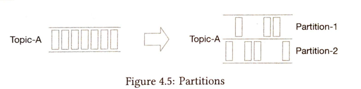
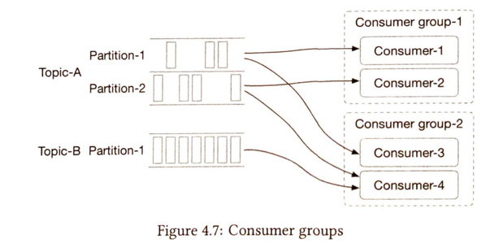
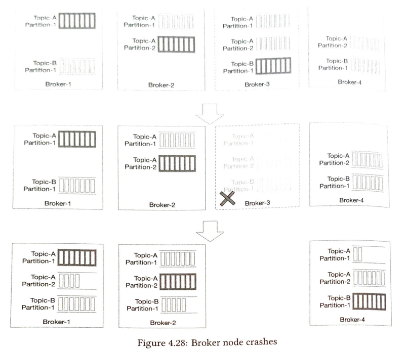
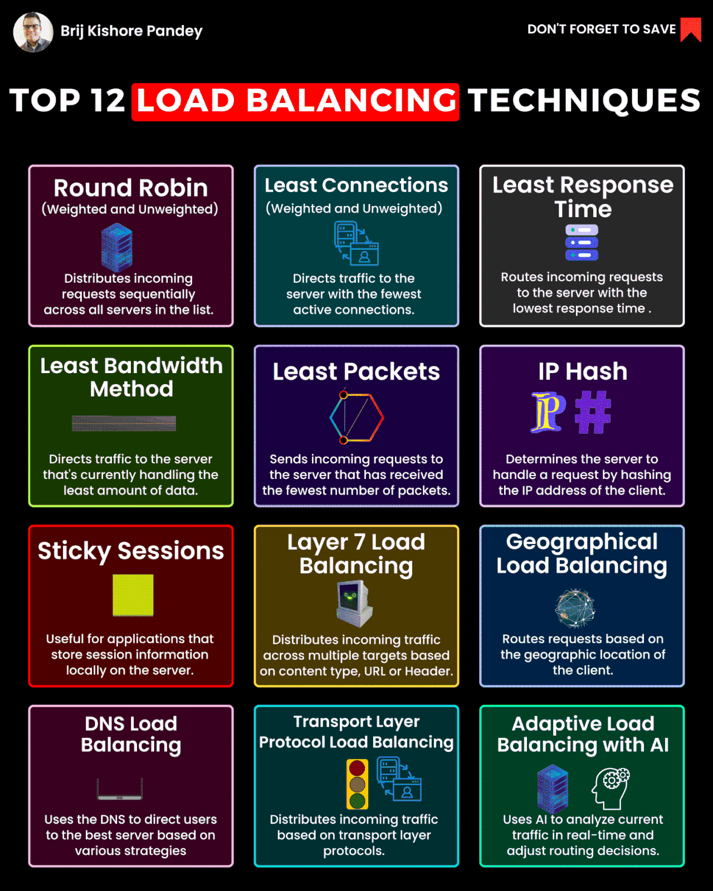
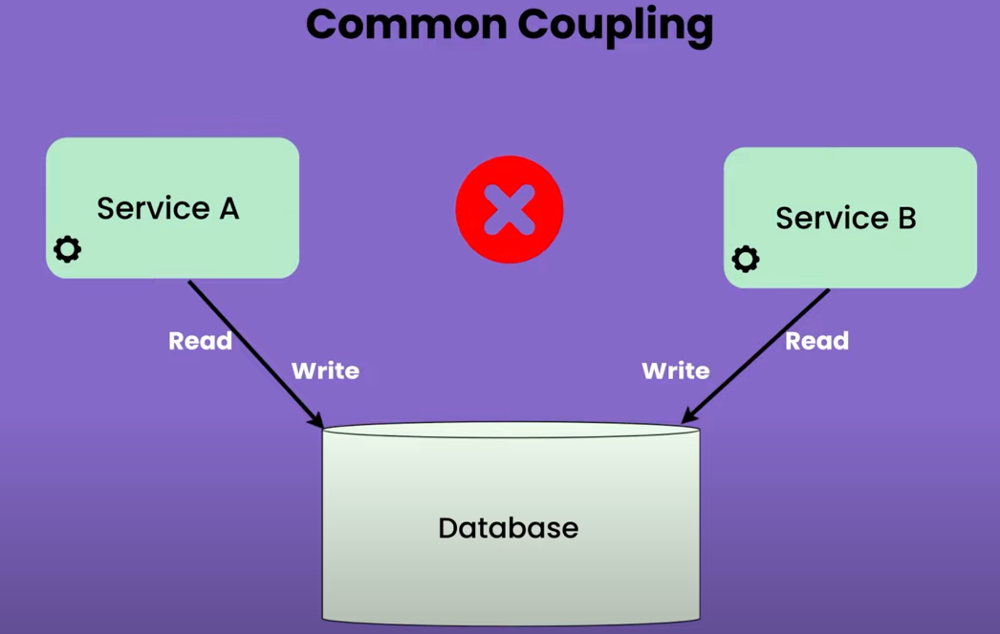
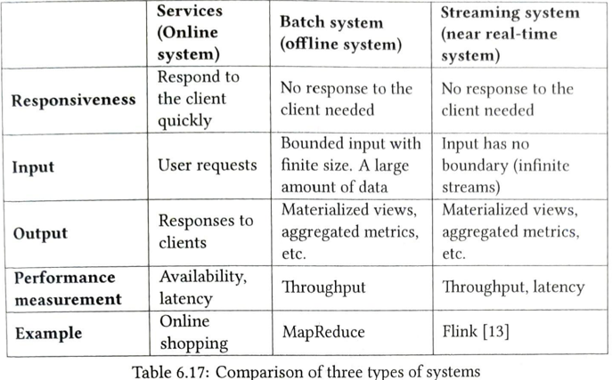

Sure, here is a compact list of all three sections to prepare for system design interviews:

Concepts

## Non Functional Requirements
- CAP-based tradeoffs   
- Availability
  - Data centers - Geo(partitioning?)
    - To improve availability and provide a better user experience across wider geographical areas, supporting multiple data centers is crucial.
    - geoDNS is a DNS service that allows domain names to be resolved to IP addresses based on the location of a user.
    - Users are geoDNS-routed, also known as geo-routed, to the closest data center
    - In the event of any significant data center outage, we direct all traffic to a healthy data center.
    - Several technical challenges must be resolved to achieve multi-data center setup:
      - Traffic redirection: Effective tools are needed to direct traffic to the correct data center.
      - Data synchronization: Users from different regions could use different local databases or caches.
      - In fail-over cases, traffic might be routed to a data center where data is unavailable.
        - Test and deployment: With multi-data center setup, it is important to test your website/application at different locations. Automated deployment tools are vital to keep services consistent through all the data centers
- Consistency
- Partition tolerance
  - Redundancy
- Failover and fault tolerance mechanisms
- Distributed consensus protocols
  - RAFT
- Scalability
  - Vertical
    - Single point of failure
  - Horizontal
    - Add Redundancy and Fault tolerance 
    - Scale infinitely
    - Need bunch of other tools like LB, Reverse proxy.  
- [Concurrency](Concurrency.md)

## Data Storage and management
- [Look into Databases for deep dive](Database.md)
  - SQL
    - Postgres
    - MySQL
    - MsSQL
  - NoSQL
    - Key-value
    - Document
    - Graph
    - Column store
    - Time Series
      - Using time series DB is useful for read, write and data visualization
  - Data Replication: Master-slave replication, Multi-master replication, Paxos algorithm
  - Distributed transactions ( commit across multiple services/databases, covered in database section)
  - Data Partitioning
    - Sharding
    - Range partitioning
    - Hash partitioning
    - Geo partitioning
  - Data Durability and Fault Tolerance: ACID properties, BASE/CAP theorem
  - Redundancy: Creating multiple copies of data or components to ensure availability and fault tolerance
  - Distributed data storage and consistency
  - Data caching and eviction policies ( refer to caching )
  - Data modeling for high-performance and scalability
  - GeoData
    - Geohash for searching geodata
    - Postgres GIS extension for geospatial indexing and analysis
- Search

## Messaging
- For a system that receives more data than it can process, we can use Message Queue. Our data is persisted before being processed, Help decoupling.  
- Message brokers and queues
  - Topic
    - Can be scaled by adding more partitions
  - Partition is like buckets inside topic
  - Broker
    - Server that holds partitions that is called broker.
    - Distribution of partitions across brokers is the key to high scalability
  - 

        
Partition

        
    

  - 

        
Consumer Group

        
    

- Message ordering and reliability
- Event-driven architectures and systems
- Publish-subscribe messaging patterns
- With partition replication, when broker node crashes, leaders are replaced.
- 

      
Broker Node recovery

      
  

## Caching
- In-memory cache (Redis, Memcached)
- Cache types and strategies: LRU, LFU, LRU-MQ
- Cache invalidation and consistency
- Performance bottlenecks and optimization techniques
- Load balancing and scalability considerations
- Types
  - Write-Back
    - Faster writes: Changes are written only to the cache first.
  - Write-Through
    - Slower writes: Changes are written to both the cache and main memory simultaneously.
    - Always consistent
  - Write-Around
    - Bypasses cache for writes: Data is written directly to main memory, skipping the cache.
    - Less/eventual consistent

- A cache is a temporary storage area that stores the result of expensive responses or frequently accessed data in memory so that subsequent requests are served more quickly.
- The application performance is greatly affected by calling the database repeatedly. The cache can mitigate this problem.
- Here are a few considerations for using a cache system
   - Decide when to use cache. Consider using cache when data is read frequently but modified infrequently.
   - Expiration policy
      - It is advisable not to make the expiration date too short as this will cause the system to reload data from the database too frequently. Meanwhile, it is advisable not to make the expiration date too long as the data can become stale.
   - Consistency: This involves keeping the data store and the cache in sync. Inconsistency can happen because data-modifying operations on the data store and cache are not in a single transaction. When scaling across multiple regions, maintaining consistency between the data store and cache is challenging.
   - Mitigating failures: A single cache server represents a potential single point of failure
   - Another recommended approach is to overprovision the required memory by certain percentages.
   - Eviction policies
   - Stateless web tier by extracting user/session details to a data store

## Networking and Protocols
- TCP
  - Set of rules to send data between two computers, 
  - Files are broken down to individual packets(they are numbered for assembling).
  - Once they arrive, packets are reassembled based on numbers. 
- UDP
  - DNS lookup uses UDP, no packet numbering mechanisms.
- http/https is application level protocol built on top of TCP to abstract loading 
- API paradigms
  - REST
  - GraphQL
  - gROC
    - gRPC ( used for server to server)
    - gRPC web ( used for web to servers)
    - Powered by protocol buffers (kind of json, data is serialized to binary format for storage efficient, but not human-readable like JSON)
  - WebSocket
    - Unlike http, bidirectional communication
    - Connection established
    - Once connection down, it won't automatically reestablish connection
    - Connection initiated by client.
    - It is bi-directional and persistent. It starts its life as a HTTP connection and could be “upgraded” via some well-defined handshake to a WebSocket connection.
  - Long polling
    - Need to set/reset header for every request
  - Server sent events 
    - Uni directional ( server to client )
    - Once connection down, it automatically reestablishes connection.
- Load balancers
  - Convey the type of load balancing ( Active passive etc )
  - Improves system availability
  - A load balancer evenly distributes incoming traffic among web servers that are defined in a load-balanced set.
  - The load balancer communicates with web servers through private IPs.
  - 

        
Load Balancing Techniques

        
    

- Reverse proxies and request routing
- Web sockets and real-time communication
- Remote procedure calls (RPC)
- Consistent hashing for load balancing
- Content delivery networks (CDNs)
    - A CDN is a network of geographically dispersed servers used to deliver static content.
    - Suitable for static onctent
      - CDN servers can update data based oni push/pull based approach. 
    - Considerations
      - Cost
      - Expiration time
      - CDN fallback to fetch data from origin

## Big Data and Stream Processing
- Big data processing frameworks: Hadoop, Spark, Kafka
- Batch processing and data pipelines
- Stream processing and real-time data analytics
  - Flink consumer
     - Can keep a copy of local table so join with every message to move it to respective sub table/partition
     - Can handle messages in real time
     - Comes with stateful computation for handling deduplication 
  - Spark streaming consumer
     - can keep a copy of local table so join with every message to move it to respective sub table/partition
     - Can handle messages in mini batches.
  - Apache Kafka and its role in big data
  - Data ingestion, processing, aggregation and compression
  - Data Aggregation
     - Time based aggregation
     - Aggregation windows
        - Tumbling windows - Fixed length and fixed start time, non overlappting i.e start of every minute.
        - Hopping window - 0-5, 1-6, 2-7 etc, overlaps.
        - Sliding window - Maintain LL to find for any range
  - Data encoding frameworks
    - If you know the data format, you can use, ignore invalid data, you can use 
      - Avro
      - Protocol buffers
      - Thrift
   - Data visualization and dashboards
- ### Event Sourcing / Event store 
  - Helps to see historical state changes by recording all events.
  - Useful in systems where you need reconciliation. 
## Service Discovery and Orchestration
- Service discovery protocols: ZooKeeper, Consul, etcd
- Service registration and discovery
- Distributed systems and microservices architecture
- Container orchestration platforms: Kubernetes, Docker Swarm
- Automated deployment and scaling
- Monitoring and alerting for distributed systems

## Microservices
- Services needs high cohesion low coupling. ( increase cohesion and decrease coupling ) 
  - Cohesion
    - Degree to which data inside a service/module belongs together
  - Coupling
    - Knowledge of one service in another service ( higher knowledge means higher coupling )
    - Coupling is allowed, Just decide on good or bad coupling.
    - 

        
Common coupling(Avoid 2 services updating similar data to database)

        
      

## Security and Reliability:
- Authentication and authorization mechanisms
- Data encryption and security protocols
- Distributed transaction management
- Resilience and fault tolerance strategies
- Disaster recovery and backup plans
- Performance monitoring and alerting

## Deep dive tips
- Kafka/Message queue
  - Address events that arrive later than expected.
  - Duplicate events
  - Broker recovery.
  - Timestamp issue ( API server will not give accurate results, need to discuss trade-offs with business)
  - Suggest time series DB vs Customer aggregation by maintaining windows. 
  - Batch system offline vs Streaming system ( near real time )
    - 

        
Batch vs Streaming

        
      

- SQL Database 
  - Replication 
  - Partitioning 
  - Indexing 
  - Concurrency 
- Disk/SSD
- NoSQL 
  - Conflict resolution
- Cache
  - Requires careful benchmarking and cost analysis
## Organize
- Content Delivery Network (CDN): https://lnkd.in/gjJrEJeH
- Caching: https://lnkd.in/gC9piQbJ
- Distributed Caching: https://lnkd.in/g7WKydNg
- Latency vs Throughput: https://lnkd.in/g_amhAtN
- CAP Theorem: https://lnkd.in/g3hmVamx
- Load Balancing: https://lnkd.in/gQaa8sXK
- ACID Transactions: https://lnkd.in/gMe2JqaF
- SQL vs NoSQL: https://lnkd.in/g3WC_yxn
- Consistent Hashing: https://lnkd.in/gd3eAQKA
- Database Index: https://lnkd.in/gCeshYVt
- Rate Limiting: https://lnkd.in/gWsTDR3m
- Microservices Architecture: https://lnkd.in/gFXUrz_T
- Strong vs Eventual Consistency: https://lnkd.in/gJ-uXQXZ
- REST vs RPC: https://lnkd.in/gN__zcAB
- Batch Processing vs. Stream Processing: https://lnkd.in/g4_MzM4s
- HeartBeat: https://lnkd.in/g4x7sMrF
- Circuit Breaker: https://lnkd.in/gCxyFzKm
- Idempotency: https://lnkd.in/gPm6EtKJ
- Database Scaling: https://lnkd.in/gAXpSyWQ
- Data Replication: https://lnkd.in/gVAJxTpS
- Data Redundancy: https://lnkd.in/gNN7TF7n
- Database Sharding: https://lnkd.in/gMqqc6x9
- Proxy Server: https://lnkd.in/gi8KnKS6
- Domain Name System (DNS): https://lnkd.in/gkMcZW8V
- Message Queues: https://lnkd.in/gTzY6uk8
- WebSockets: https://lnkd.in/g76Gv2KQ
- Consensus Algorithms: https://lnkd.in/ggc3tFbr
- Fault Tolerance: https://lnkd.in/dVJ6n3wA
- Failover: https://lnkd.in/dihZ-cEG
- Gossip Protocol: https://lnkd.in/gfPMtrJZ
- API Gateway: https://lnkd.in/gnsJGJaM
- Distributed Locking: https://lnkd.in/gRxNJwWE
- Distributed Tracing: https://lnkd.in/d6r5RdXG
- Bloom Filters: https://lnkd.in/dt4QbSUz
- Checksum: https://lnkd.in/ghNc5pfn

## Technologies
1. Databases:
    - MySQL, PostgreSQL, Oracle
    - MongoDB, Cassandra, Redis
    - DynamoDB, Elasticsearch

2. Message Brokers and Queues:
    - Kafka, RabbitMQ, Amazon SQS
    - Azure Service Bus, Apache Pulsar

3. Load Balancers and Reverse Proxies:
    - ELB, NGINX, HAProxy
    - Azure Load Balancer, Google Cloud Load Balancing

4. Web Sockets and Real-time Communication:
    - Socket.io, WebRTC
    - Apollo Server, GraphQL subscriptions

5. RPC Frameworks:
    - gRPC, Thrift
    - Apache Thrift, Finagle

6. Big Data Frameworks:
    - Apache Hadoop, Apache Spark
    - Apache Kafka, Apache Flink

7. Service Discovery and Orchestration Platforms:
    - ZooKeeper, Consul, etcd
    - Kubernetes, Docker Swarm
    - HashiCorp Nomad, Amazon ECS

8. Monitoring and Alerting Tools:
    - Prometheus, Grafana
    - Splunk, DataDog
    - New Relic, ELK stack
