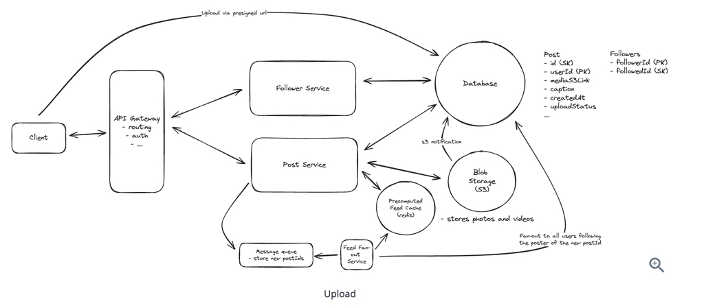

## Database
- SQL
  - Postgres
  - MySQL
  - MsSQL
- NoSQL
  - Key-value
  - Document
  - Graph
  - Column store
  - Time Series
    - Using time series DB is useful for read, write and data visualization
- Data Replication: Master-slave replication, Multi-master replication, Paxos algorithm
- Distributed transactions ( commit across multiple services/databases, covered in database section)
- Data Partitioning
  - Sharding
  - Range partitioning
  - Hash partitioning
  - Geo partitioning
- Data Durability and Fault Tolerance: ACID properties, BASE/CAP theorem
- Redundancy: Creating multiple copies of data or components to ensure availability and fault tolerance
- Distributed data storage and consistency
- Data caching and eviction policies ( refer to caching )
- Data modeling for high-performance and scalability
- GeoData
  - Geohash for searching geodata
  - Postgres GIS extension for geospatial indexing and analysis
- Search

### Questions
- Decide DB based on 
- Data access patterns
  - Read/write ratio
- Need ACID?
- Structured/Unstructured data?

> Consistency make database harder to scale.

| Database             | Usecase                                                               |
|----------------------|-----------------------------------------------------------------------|
| GraphDB              | Whenever there is a followers, friends or graph                       |
| Document DB          | Different data types + Queries(limited support)                       |
| Column DB            | Ever increasing data + finite queries, Cassandra(light weight), Hbase |
| Time series database | Sequential/append only write mode(InfluxDB, openTS DB)                |
| Analytics database   | Hadoop                                                                |
| Blob storage         | S3 + CDN (region based serving)                                       |

  
Types of Databases

  

- Non-relational databases might be the right choice if: • Your application requires super-low latency.
- Your data are unstructured, or you do not have any relational data.
- You only need to serialize and deserialize data (JSON, XML, YAML, etc.).
- RDBMS
  - Replication
    - [Replication](Sharding.md#replication)
    - Single leader replication -> All write to once DB and reads from any (fast reads)
    - Multiple leader replication -> All write goes to small group, read from any (fast writes, but inconsistent data)
    - Leaderless replication -> write to all, read to all. (slow read writes)
    - How to handle data syncing during replication
      - **TODO**
  - Master/Slave
    - A master database generally only supports write operations. A slave database gets copies of the data from the master database and only supports read operations. All the data-modifying commands like insert, delete, or update must be sent to the master database. Most applications require a much higher ratio of reads to writes; thus, the number of slave databases in a system is usually larger than the number of master databases.
      - Advantages of database replication:
           - Better performance: In the master-slave model, all writes and updates happen in master nodes; whereas, read operations are distributed across slave nodes. This model improves performance because it allows more queries to be processed in parallel.
           - Reliability: If one of your database servers is destroyed by a natural disaster, such as a typhoon or an earthquake, data is still preserved. You do not need to worry about data loss because data is replicated across multiple locations.
           - High availability: By replicating data across different locations, your website remains in operation even if a database is offline as you can access data stored in another database server.
       - If the master database goes offline, a slave database will be promoted to be the new master. All the database operations will be temporarily executed on the new master database. A new slave database will replace the old one for data replication immediately. In production systems, promoting a new master is more complicated as the data in a slave database might not be up to date. The missing data needs to be updated by running data recovery scripts.
  - Scaling
     - Vertical scaling
        - Add more power to existing machine. AWS RDS can support upto 24Tb of memory.
        - Stackoverflow in 2013 with one master shards handled 10 million unique users.
        - Drawbacks
          - Hardware limits
          - SPOF
          - High cost
     - Horizontal scaling / Sharding
       - [Sharding](Sharding.md)
  - RDBMS uses complex two-way locking mechanism to achieve correctness and maintain ACID property.
- NoSQL
   - Instead of storing data in rows, we can store data in documents with IDs and I can store nested documents. We can store ton of data in this collection. 
   - Limited querying capabilities. 
   - Storing denormalized duplicate data lead to inconsistency ( need to sync)
   - Most support transactions.
   - Better for read intensive and non structured data
   - No consistencies. Since we don't have to enforce consistencies, we can break up our database and scale it horizontally ( sharding )
   -
   - NoSQL Databases
     - MongoDB
       - Support transactions and Btrees
     - Cassandra
       - Fast writes, slower reads, compromise a little on consistency and occasional data is lost on overwritten 
       - Wide column data store like spreadsheet
       - Support multi leader and leaderless replication ( configurable )
       - Support quorum writes
         - Each data operation, such as read or write, requires a certain number of nodes to acknowledge the operation before it is considered successful. This number is called the quorum and is usually a majority of the nodes.
       - Write conflicts - cassandra let last write wins. There can be issues if lower time stamps write processed later
       - Use LSM tree and SSM tables for indexing
       - Slower reads
       - Ideal for chat applications where chat ID is used to decide the shard and all of the messages are ordered by timestamp as sort key
       - Weakness - 
         - Conflict resolution ( last write wins)
         - SLower reads
     - RIAK
       - Key Value store 
       - Same as cassandra ( cassandra is wide column store )
       - Use CRDTS(conflict free replicated data types) in order to deal with conflict resolution
       - Aggregating conflicting writes and process them
       - Handy when dealing with counters and sets in multi leader or leaderless replication 
       - eventually consistent
     - Apache Hbase
       - Wide column as cassandra
       - Built on top of Hdfs/Hadoop. 
       - Only single leader replication
       - No need to worry about write conflicts
       - Used column wide storage to store data. Helpful for column based locality. 
       - Useful for fast reads on columns. 
     - MemCache and Redis
       - Key value stores
       - Implemented in memory
       - Redis rich feature set-> geo sharding, sorted sets, 
       - Built using hashmap internally. 
       - Worse for range queries
       - Useful small data sets since in memory
       - Useful in geo spatial index in uber and swiggy, constantly update driver locations. 
     - Neo4j
       - Graph databse
       - We can use Graph in SQL with many to many relationships but very slow. 
       - Graph with SQL capabilities
       - Pointers to actual location of adjacent nodes, fetch in constant time opposed to SQL based constant time.
       - Map data, modelling friends. 
     - TimeScaleDB/Apache Druid
       - Append only database is one option
       - LSM Tree + SS Tables for indexing -> fast writes
       - Multiple LSM indexes with time indexed data
       - Use tombstone method to delete irrelevent data
       - Useful for logs, sensor data, ingestion etc
       - Instead of one large index for one table, they split the table to bunch of mini index. SO write and read will be effective
       - They also delete certain data once its old.
       - Very high write throughput
       - Regular and irregular writes
       - Data needs to be highly compressed
       - Large range scans of many records, so need to handle rollup and aggregation mechanism before if it make sense.
       - Write latest time entry only
       - Using time series DB is useful for read, write and data visualization
    
### Performance of Mysql
#### Concurrency
- Pessimistic concurrency control vs Optimistic concurrency control
  - Database handle these locks in row level. If a single row is being concurrently handled by 1000s of queries, that's a really a bad design.
  - If data access conflicts are very rare, go with optimistic or use pessimistic. 
  - In pessimistic, locks are used. 

### CAP theorem
- Consistency : All nodes in the partition has the data at same time. 
- Availability : System's ability to remain accessible even if one or more nodes in the system go down. Every request received by a non failing node in the system must have a response. 
- Partition tolerance : Data is sufficiently replicated across combinations of nodes and networks to keep the system up through intermittent outages
- According to the CAP theorem, any distributed system needs to pick two out of the three properties. The three options are CA, CP, and AP. However, CA is not really a coherent option, as a system that is not partition-tolerant will be forced to give up either Consistency or Availability in the case of a network partition.
- 

    
CAP theorem

    
  

- 

    
PACELC theorem

    
  

### Distributed transactions ( Handle state changes in distributed systems )
- Two difference service and respective databases, when you change state in 1 DB in 1 service, second also needs to be updated. 
- 

    
Distributed Transaction

    
  

- 1. Two phase commit ( orchestrator to locking/voting and commit both database rows)
  - Likely to cause Long living transactions in large database tables.
- 2. SAGA approach
  - Backward recovery to undo steps/commits in different databses
    - 

        
SAGA backward recovery

        
    

  - Forward recovery is to retry failed steps, if it doesn't work undo.
- Two ways to implement
  - a. Orchestrator
    - 

        
Orchestrator approach

        
    

  - b. Choreography ( event based actions from services )
    - 

      
Choreography approach

      
    

    - Hard to find where is the problem.
    - Use correlation id (trace id) to track it down.

### Organize
- Tune memory size
- Migrating live prod database is very complex and costly
- Cassandra handle high volume of writes

### Check 
- What is read after write consistency

### Number
So 9.3 million rows + 1 m and expected increase of 3-5 million rows every year. So I'm wondering if I will regret this decision in 2 years time or will PostgreSQL be still doing fine with 20M rows, 40M rows, 100M rows, ...
I'm running General Purpose, 8 vCore(s), 50 GB Azure PostgreSQL barely scratching 40% CPU (I will be downscaling it soon)