# Problems

## Main list

|    | Problem                         | Attempted          | Confident | Key Concepts                                                        |
|----|---------------------------------|--------------------|-----------|---------------------------------------------------------------------|
| 1  | Distributed Metrics/Logging     | :x:                | :x:       | - Distributed Systems - Logging - Metrics - Event Sourcing |
| 8  | Notification System             | :white_check_mark: | :x:       | - Notifications - Pub/Sub - Distributed Systems               |
| 10 | Chat                            | :white_check_mark: | :x:       | - Real-time Messaging - Websockets - Pub/Sub                  |
| 12 | Youtube                         | :x:                | :x:       | - Video Streaming - Content Delivery - Recommendation Systems |
| 2  | Rate Limiter                    | :white_check_mark: | :x:       | - Rate Limiting - Distributed Systems                            |
| 6  | URL shortener                   | :white_check_mark: | :x:       | - URL Shortening - Hashing - Redirects                        |
| 7  | Web crawler                     | :white_check_mark: | :x:       | - Web Crawling - Distributed Systems                             |
| 9  | News feed system                | :white_check_mark: | :x:       | - News Feed - Social Networks - Algorithms                    |
| 11 | Search autocomplete             | :x:                | :x:       | - Search Algorithms - Autocomplete - Data Structures          |
| 13 | Drive                           | :white_check_mark: | :x:       | - File Storage - Cloud Storage - Distributed Systems          |
| 5  | UID generator                   | :x:                | :x:       | - Unique Identifier - Distributed Systems                        |
| 28 | Job Scheduler                   | :white_check_mark: | :x:       |                                                                     |
| 14 | Swiggy/Doordash                 | :white_check_mark: | :x:       | - Food Delivery - Geolocation - Order Management              |
| 15 | Kids safety                     | :white_check_mark: | :x:       | - Child Safety - Parental Controls - Monitoring               |
| 16 | Proximity service               | :x:                | :x:       | - Proximity Detection - Location-based Services                  |
| 17 | Nearby friends                  | :x:                | :x:       | - Location Sharing - Social Networks                             |
| 18 | Google map                      | :x:                | :x:       | - Maps - Geolocation - Routing - API                       |
| 4  | KV store                        | :x:                | :x:       | - Key-Value Store - NoSQL Databases                              |
| 20 | Metrics Monitoring and alerting | :x:                | :x:       | - Monitoring - Alerting - Distributed Systems                 |
| 21 | Ad click event aggregation      | :white_check_mark: | :x:       | - Ad Tech - Event Aggregation - Analytics                     |
| 22 | Hotel reservation               | :white_check_mark: | :x:       | - Reservation Systems - Booking Platforms                        |
| 23 | Distributed Email service       | :x:                | :x:       | - Email - SMTP - Distributed Systems                          |
| 24 | S3 like blob storage            | :x:                | :x:       | - Object Storage - AWS S3 - Distributed Systems               |
| 25 | Payment                         | :white_check_mark: | :x:       | - Payment Gateways - Transactions - Financial Systems         |
| 26 | Digital wallet                  | :x:                | :x:       | - Digital Payments - Wallets - Cryptocurrency                 |
| 27 | Stock exchange                  | :x:                | :x:       | - Stock Trading - Financial Markets - Exchange Platforms      |
| 19 | Distributed Message Queue       | :white_check_mark: | :x:       | - Message Queues - Pub/Sub - Distributed Systems              |

## Problems from Leetcode
- [x] Design web crawler
- [x] Design online chess
- [x] Design whatsapp
- [x] Design price alert system similar to camelcamelcamel.com
- [x] Design proximity server.
- [ ] Design a system to store images for FB and insta that would require 1000 uploads per sec and handle duplication. 
- [x] Design YouTube 
- [x] Design the Facebook post privacy functionality. In other words, if I make a Facebook post, and I have 3 privacy options to choose from (Only Me, Friends Only, Public), design how wold you get the visibility for any Faceook user (ie. can a FB user see the post or not)
- [x] Design an online judge like leetcode
- [x] Video count in distributed system.
- [x] Design Ticketmaster.
  - More focus on:
  - Ticket booking workflows
  - What if tickets are not available?
- [ ] Netflix 
- [ ] Yelp 
- [ ] Instagram
- [ ] design messenger status
- [ ] Google drive
- [x] Ad count aggregation system (picked product architecture, but ran very similar to typical system design question). Provided both live data case and accurate data case with both CMS and persistent data storage. honestly I am not sure about this round. 
- [x] Top 10 songs played on spotify (top-k problem)

- TAG management (https://leetcode.com/discuss/interview-experience/4351482/Design-a-tagging-system-or-HLD-or-LLD)
- File download (https://leetcode.com/discuss/interview-experience/1263830/Facebook-product-design)
- Apply discount on Nth order (https://leetcode.com/discuss/interview-question/system-design/459593/Facebook-or-System-Design-or-E-commerce-Apply-discount-on-every-nth-order)
- Design Leaderboard ( Bharath )
- Realtime gaming ranking (https://leetcode.com/discuss/interview-question/system-design/625918/Amazon-or-System-Design-or-Design-a-real-time-gaming-ranking-system)
- Distributed counters
- System to give prices of stack ( https://leetcode.com/discuss/interview-question/system-design/431712/Bloomberg-or-Design-a-system-to-give-prices-of-a-stock )
- Design FigJam/Miro

## Tips
- Clarification
  - If the problem is too big, get the feedback on what I have to focus. 
  - Make sure to check if interviewer can follow you up.
  - Make sure to check if you are going in the right direction. 
- Database
  - Don't talk anything about database during estimation, clarification and initial design
  - Talk about engine selection for indexing type based on read or write heavy ([Engine selection for performance](Database.md#performance) )
- When pitching async design or event driven system
  - The design we currently have is synchronous. This is not enough because the capacity of consumers and producers are not always equal. If there is a sudden increase in traffic, we can expect more latency. 
  - We can adopt message queue to decouple consumers and producers and scale up or down when needed.
- Non functional requirements (NFR)
  - Propose NFR for service level. 
    - Example in hotel booking,
      - Booking -> consistency(to handle race condition adn duplicate booking)
      - Search -> Scalability and availability
- Design
  - Initially draw boxes, don't focus on design.
  - 
## 1. Distributed Metrics/Logging
- Use message broker
  - In memory message broker Vs Log based message broker
  - Stateless consumers
  - Time based aggregation
    - Aggregation windows
      - Tumbling windows - Fixed length and fixed start time, non overlappting i.e start of every minute. 
      - Hopping window - 0-5, 1-6, 2-7 etc, overlaps. 
      - Sliding window - Maintain LL to find for any range
  - Logs can be moved to S3
  - You cannot do data processing from S3, so need to move it to Hadoop cluster and run spark on that data.
  - Spark is a batch processing service widely used, better than map reduce 
    - Supports complicated processing and format sot hat you can throw to data warehouse
    
  

    
Architecture

    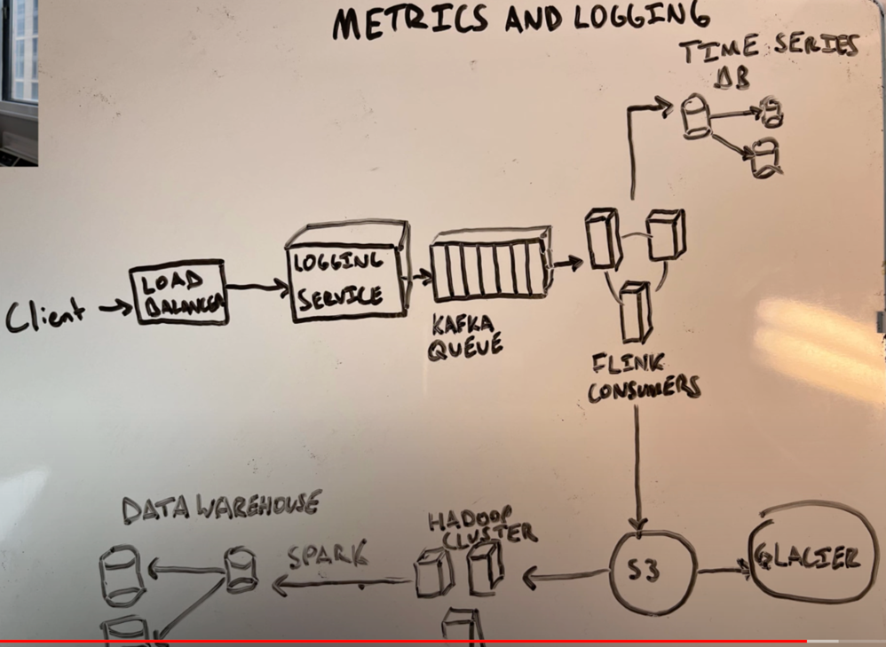
  

## 2. Rate Limiter
- Clarification
  - Missed API key part
  - Fixed window or Rolling window
  - Assuming it's a separate service instead of application code. 
- Requirements
  - Missed NFR 
    - Fault tolerance on rate limiters. 
    - Super low latency since it's an over head on processing the request.  
- API
  - Missed endpoint_name in request 
  - Missed time stamp. 
- Estimation
  - 1 million user
  - rate limiting factor ( user id/ API key ) - 8 bytes
  - 4 byte time stamp
  - 4 byte counter
  - 1mil * 16 -> 16 MB
  - Memory shouldn't be a problem, still we can partition to improve speed and fault tolerance.
- Design
  - Fixed window
    - Map with user id as key and tuple as value ()
  - Rolling window
    - Maintain list or sorted set for user in redis. ( treat it like linked list )
      - Keep pushing the data and let the cron job delete state data
    - Use small sized fix windows ( like batches )
  - Cache some information in LB/API gateway to reduce load on rate limiting servers
    - Use write back cache to sync with rate limiting services.
    - High availability, ALl writes to go to same place -> Single leader replication
  - Fault tolerance
    - If master fails, we can restart with a little loss. if not we can go with lower consistency
  - You can talk about algorithms
    - Leaky bucket
    - Token bucket
- Database
  - Partition on user id/IP/API key
  - Partition on has above and use range based partition
    
  

    
Rate Limiter Architecture

    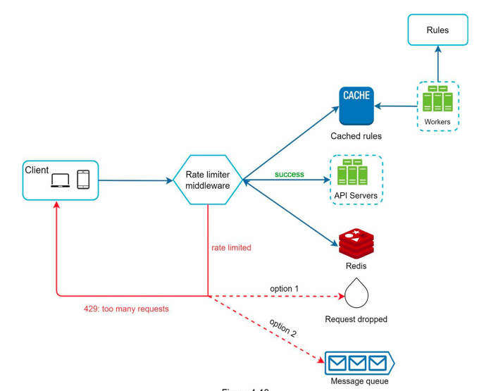
  

## 6. Tiny URL / Pastebin
- Clarification and Estimation
  - Clarification
    - How long is the shortened URL? - Clarification
        - If they as short as possible, we should define length to avoid collision.
        - Chars allowed in hash
          - Chars - a, A 0-9 => 10+26+26 = 62. So 62^n combinations possible
        - Find smallest n such that 62^n < total URL writes ( 365 billion )
    - URL deleted/updated?
    - NFR
      - Missed NFR, never talked about Availability, Consistency and Fault tolerance
    - Never mentioned read or write heavy -> mention "READ > WRITE need to optimize this"
- Problems/Critical part/Deep dives
    - Address if we are going to create a unique ID and assign it to column (id, short URL hash, long URL) or search just hash
    - How to make long hashed value short from sha/MD hash
      - 

            
Hash Shortening

            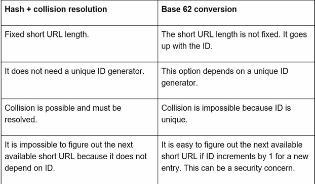
        

      - Hash + Collision resolution ( Hashed short URL needs to be verified if it exists in the system. Its costly process )
        - So use Bloom filters(A bloom filter is a space-efficient probabilistic technique to test if an element is a member of a set).
        - In case of collision 
          - Chaining
            - Not possible to store LL in DB
          - Probing
              - Or 32fz18 -> try next 32fz19 and so on.
      - Base 62 conversion ( represent values based on 0-9, a-z, A-Z => 0-61 base)
    - Redirection ( browser http status 302)
    - Database
      - Partitioning
        - by range
            - Shard based on hash/short URL first char. a-d, e-h, i-s, t-z. This will relatively work since key is already hashed and this will be evenly distributed.
        - Consistent hashing for hash/short URL
      - Lock rows when writing an entry(short and long URL)
        - 1. Predicate locks to lock row that doesn't exist. (Costly but indexing short URL will make it faster)
        - 2. Create all precomputed hashes and use them.
      - Indexing types ( what engine to use)
        - Since read heavy use B-Tree. ( Look [engine selection](Database.md#performance) )
      - DB choice
        - Single leader, partitioned and Btree based -> MySQL, Postgres
        - Mongo DB could make an argument but above make sense considering the simple data model.
    - Read speed
      - Caching for hot links. Partitioning the cache by shortURL lead to fewer cache misses.
        - Write ahead cache suitable option.
        - LRU eviction
    - Pastebin 
      - Use S3 to store blob and everything else is same.
      - Write will be 2 phase commit to store in MySQL/Postgres and S3. 
    - Extras
      - Analytics
        - column for clicks ( address race condition without locks )
        - Kafka. So use log based message broker to aggregate later (no need for DB or in memory message broker).
        - Spark streaming with mini batch since no real time required.
      - Delete expired jobs
        - Use batch jobs with CRON
    

        
Tiny URL/PasteBin Architecture

        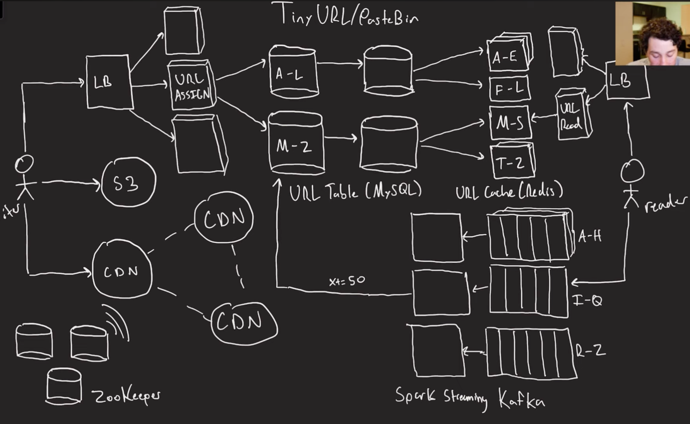
    

- Mentions
  - Monotonically increasing sequence is not a good idea since locking and indexing performance.
  - 

        
Replication strategy

        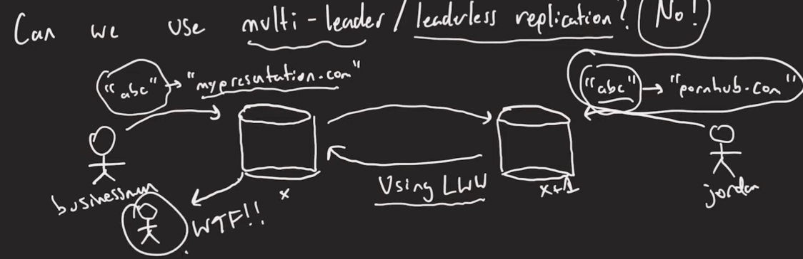
    

## Web Crawler
  - Requirement
    - Given a set of URLs, download all the web pages addressed by the URLs.
    - Extract URLs
    - Add new URLs to the download list.
  - Clarification
    - Content type
    - Raw data storage required? 
    - Do we need to handle duplication?
    - How frequently we need to check for updates 
      - Manage frequent updates/low frequent updates. 
  - NFR
    - Scalability
    - Robustness ( broken links, malicious links, corrupt html, server errors, crashes etc.)
    - Politeness - Don't put too much load into the servers, controlled crawling. 
    - Extensibility ( to support new file formats in future)
  - Estimation
    - Pages per month
    - QPS
    - Peak QPS
    
  - High level Design
    - 

        
Architecture

        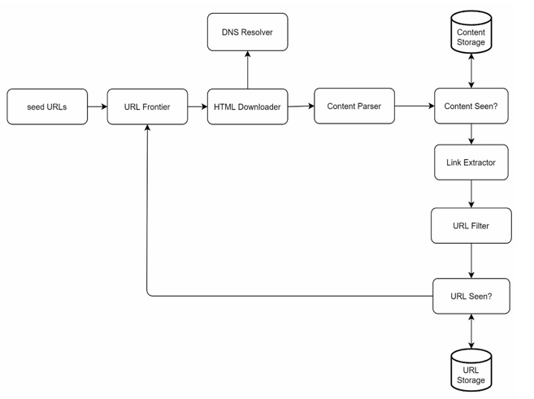
      

  - Deep dive
    - BFS vs DFS
    - BFS is best and have separate queue for group of URLs based on consistent hashing
    - Prioritizer on top of queue to fetch most important page to be crawled first. 
    - Detect and avoid problematic content
    - Robustness
      - Retry
    - Robot exclusion protocol ( robots.txt)
    - Distribute crawls
    - Cache DNS resolver since it's a bottleneck for crawlers
    - Geo routing of crawl request to crawlers to fetch from nearby IP.
    - 

        
Architecture

        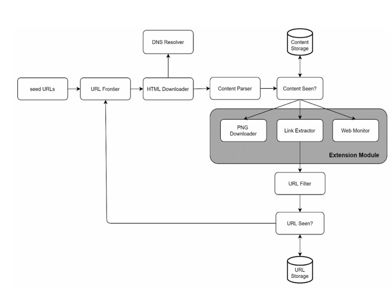
      

    - Ignore uselss data in content parser (ads, spam urls etc)
## 8. Notification System
- Requirements
  - Type of notifications
    - Push, sms and email
  - Real time? 
    - Ideally these systems are soft real time, as soon as possible with slight delay when systems are on load
  - What triggers them? 
    - Client applications and scheduled on server sides. 
  - User opting out
  - Group pushing events. 
  - Priority.
- Clarification
- Estimation
  - Notifications per day
- High level design
  - Cache user info, device info and notification templates. 
- Deep dive
  - Group pushes, batch processing. 
  - Prevent data loss
  - System failures
  - Maintain notification log.
  - Receive notification only once. 
  - Retry 
- Architecture
  - Don't forget to maintain notification log.
    - To understand common failure pattern for analytics.
    - Possibly in push notification, we can track user patterns as well. 
  - 
  - 

      
Architecture

      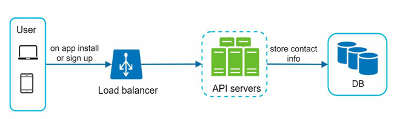
    

  - 

      
Architecture

      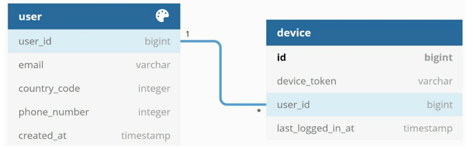
    

  - 

      
Architecture

      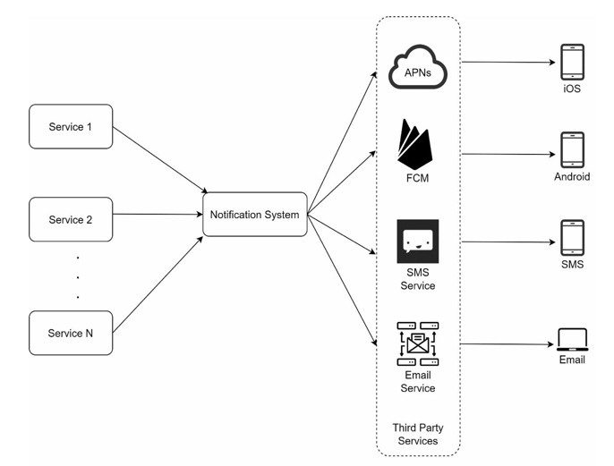
    

  - 

      
Architecture

      
    

  - 

      
Final Design

      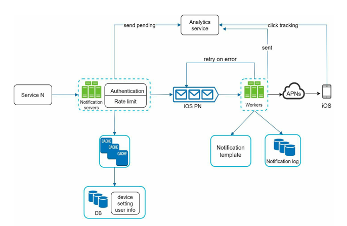
    

  - 

      
Alternate Final Design

      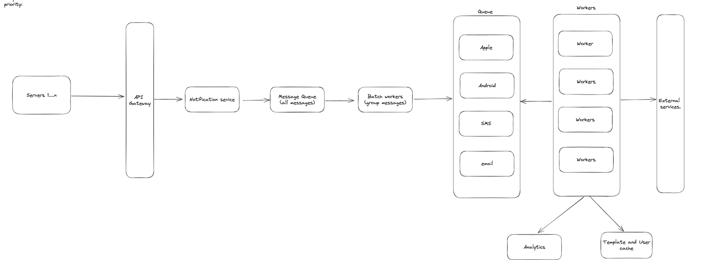
    

  
## 9. News Feed System
- Requirements
- Clarification
- Estimation
- High level design
- Deep dive
  - Fanout service
    - Fanout on write
      - When news/post written, its pushed to friends cache immediately. 
      -  Feels real time and fast. But Resource intensive(especially when user has many friends and user is not going to read i immediately)
      - Little lazy loading can be better based on user activity.
    - Fanout on read
      - News feed computed on read and  
      - Best for inactive users
    - Hybrid approach is better based on activity history/pattern 

- Architecture
 - 

      
Final Design

      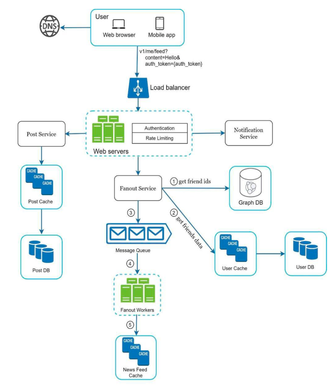
    

 - 

      
Final Design

      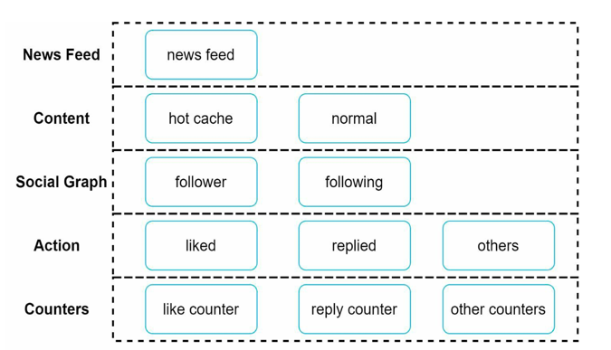
    

## 12. Youtube
- Requirements
  - Watch videos
  - Upload videos
    - Encryption?
    - Size?
  - Like/Dislike
  - Playlists? 
- Clarification
- NFR
  - Watching
    - Availability
  - Upload
    - Availability
    - Integrity and Durability
- Estimation
  - DAU
  - Average time spent per user
  - 
- High level design
  - Everything else except viodeo streaming goes through API servers. 
- Deep dive
  - Geo distribution is important
  - CDN is important
- Architecture
## 13. Drive/Google Drive/Box
- Requirements
  - Files supported
    - Files need to be encrypted?
    - Size limit
  - Users
  - Average users storage
  - File versioning
  - Share
  - File preview
  - Search?
  - NFR
    - Durability ( replication and geo distribution )
    - Availability
    - Scalability
    - Data integrity
- Clarification

- Estimation
- High level design
  - 1:1 read/write ratio
  - Block servers
    - To upload data by blocks in BD.
    - Use checksum or hash to verify data integrity
    - Split compress, encrypt order and store data
- Deep dive
  - Upload
    - Simple upload for smaller files
    - Resumable upload for really large files.
    - Maintain size
    - Sync conflicts on shared drives.
    - Write metadata and then upload file.
- Architecture
- 

    
Region replication

    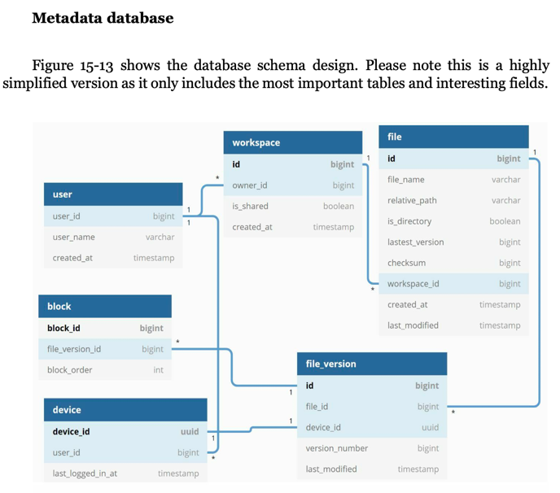
  

- 

    
Region replication

    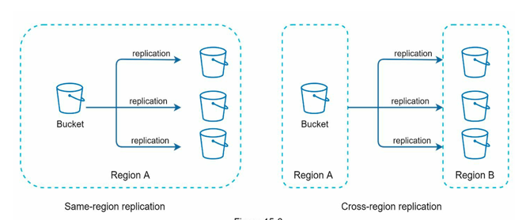
  

- 

    
High Level Design

    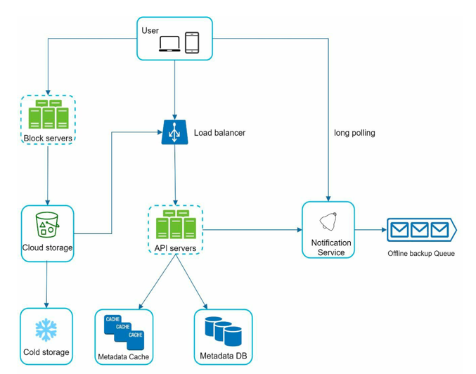
  

- 

    
Final Design

    
  

## Ticketmaster
- Requirements
  - City => Movie => Theatre => Time => seats
  - If seats are available, reserve them until booking. 
  - If reserved, join FIFO wait list queue to take over if booking was dropped. 
- Clarification
- NFR
  - High consistency (ACID)
  - Atomicity -> all or nothing
    - Need to implement reserving in section level instead of seat level since seat level is complicated.
      - May be allow number of seat booking in a section without selecting seats ( just specify number of seats )
  - Concurrency control
- Estimation
  - 500 cities, 10 theatres , 2000 seats, 2 shows per day. 
  - 2000000 tickets
  - 24 bookins per sec
  - Booking at peak 250/sec
  - 50 bytes per booking data => ? 
- API
  - GET cities, Theatres, shows with times, seats
  - POST booking 
  - 
- High level design
  - No to Nosql since we need transactions and concurrency control
  - Keep linkedhashmap and provide booking id during reserve/blocking seat itself and release the if seats are freed.  
- Deep dive
  - Race condition
  - Seat blocking
  - All seat or nothing
- Architecture

## Proximity Service
- Requirements
- Clarification
- Estimation
- High level design
- Deep dive
- Architecture
- 

    
Proximity

    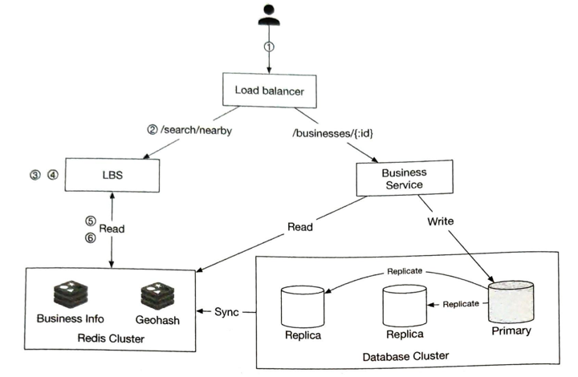
  

## Dummy
- Requirements
- Clarification
- Estimation
- High level design
- Deep dive
- Architecture

## Dummy
- Requirements
- Clarification
- Estimation
- High level design
- Deep dive
- Architecture
## 10. Chat/Messenger
- Estimation
  - 500 million users, 40 message per day
  - 100 bytes per message
  - 20 billion message per day
  - 2TB storage per day
  - 3.5PB storage per 5 years

- Requirements
  - Group chat
  - Send and receive message in real time
  - Keep old messages in DB
- Design
  - Database
    - User
    - Chats (chat id, time stamp etc)
    - UserChat (userId, Chat ID) -> index both => to see list of chats.
    - Message table (chat id, message, timestamp)
    - NoSQL is best
      - Ton of writes ( cassandra best for writes and schemaless)
      - Cassandra uses leaderless replication
  - Long polling not a good option since we need reset header every time. 
  - When chat server goes down, we need to allocate different server to handle user connection.
    - Reestablish handshake when a chat server goes down cause thundering herd problem. Might cause cascading failure. 
  - Because of above reasons, server sent events are best since they reestablish connection when disconnect when websockets don't.
  - For group messages
    - No need for distributed transaction since they are not that important, and we can rely on eventual consistency since some of them might be offline.
    - First need to upload message to DB and then distribute to all members or send concurrently also. 
  - Ordering of messages
    - Everyone see all the messages in same order or the order at which they are processed? 
      - Use timestamp on the device that sent a message or timestamp on the server that receives the message?
      - Timestamps are not perfect, but at least we can make it consistent
- 

      
Chat Main Architecture

      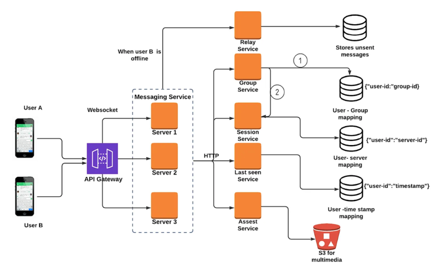
  

- 

      
Chat Architecture

      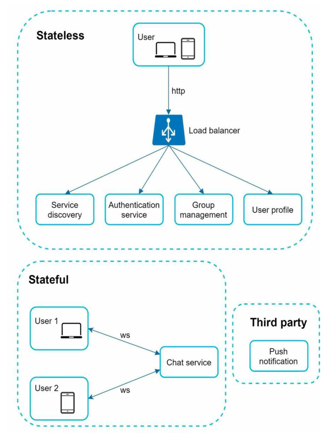
      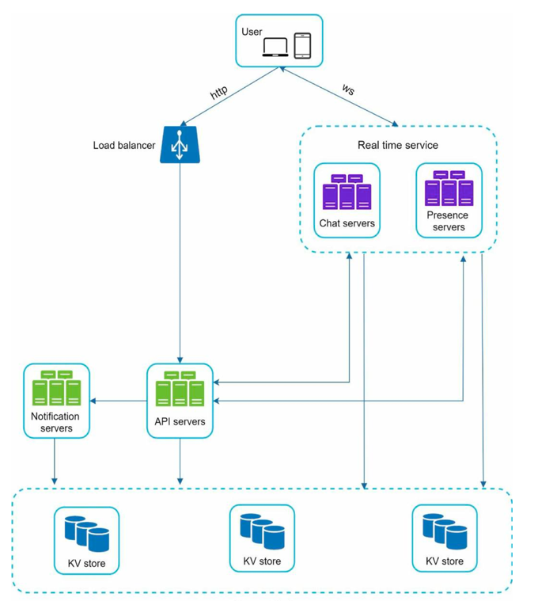
  

## 19. Distributed Message Queue
- Check [Message Broker](Concepts.md#messaging)
- Clarification
  - Durable queue
  - Push message
  - Consume message (pull/push)
  - Message
    - Size limit? 
    - Structured/Unstructured? 
    - Media? 
  - Consumer acknowledge mechanism
  - Order of pushing and consuming same?
  - How many producers and consumers?
  - Message consumed by multiple consumer?
  - Delivery semantics
    - At most once, at least once, exactly once
- NFR
  - High throughput / low latency
  - Scalable
  - Persistent
- Estimation
  - Sc
- Design
  - To achieve throughput
    - Go with SSD or sequential disc access approach after defining message data structure
    - Small I/O is a hurdle to achieve high throughput, so use mini batching. 
  - Zookeeper to store list of partitions and its servers. 
  - Storage
    - Database (Message as SQL rows / NoSQL) / WAL ( write ahead logs ) which is basically a file with sequential access pattern to increase speed.
    - WAL log files on disk is better choice.
    - For metadata storage use zookeeper
  - Routing layer between producer and broker to redirect to sharded broker
  - Broker will be replicated with a single leader
    - To guarantee durability, acknowledge back to producer only after all broker replicas persisted message. 
  - Consumer pull vs Push model
  - Coordinator to organize and discover consumers.
  - Failure recovery
    - When broker node crashes, look [Message Broker](Concepts.md#messaging)
  - Increase/Decrease paritions
  - Delivery semantics
    - At most once, at least once, exactly once
      - Send `ACK=1` or `ACK=all` with request(possibly as a header) to handle it in queue.
      - Exactly once is difficult and expensive.  
  - Message filtering
    - Add tags with messages.
    - Consumers can subscribe to tags with broker.
    - Tag filter that sits in broker serve accordingly. 
  - 

        
Message broker flow

        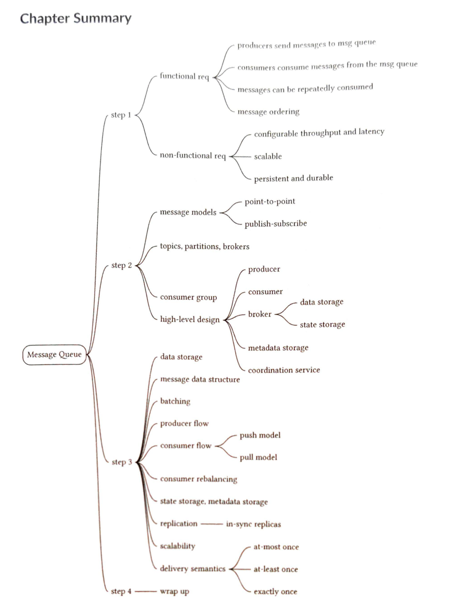
    

  - 

        
Architecture

        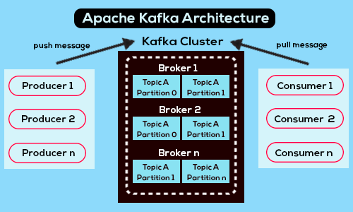
    

## 21. Ad click event aggregation
- Clarification
  - Ad click events as input
    - File/Stream/APIs
  - Supported queries
    - ad clicks for an ad in last M minutes/time range
    - Top 100 clicked ads in last 1/M minutes
    - Support filtering by ad_id, country and category
  - NFR
    - Highly available
    - Accuracy ( strong consistency)
    - Fault tolerance
    - Deduplication of events
- Estimation
  - 1 Billion ad clicks, 2 million ads
  - QPS = 10^9/10^5 sec = 10000 clicks per second
  - Peak QPS = 5x10000 = 50000
- APIs
  - GET /clicks/{id} (ad_id, TimeRange)
  - GET /clicks/top (TimeRange)
  - GET /clicks (Filters)
- Design
  - Data
    - Raw data 
      - ad_id, timestamp, region, user_id, ip
      - Not going to be queried
      - write heavy
    - Aggregated data
      - ad_id, minute_in_long, count, filter_id (multiple ad_id can exist to fast filtering)
      - filter_id, region, ip, user_id
      - will be queried
      - read heavy
  - Database
    - Cassandra ( time series ) / TimeScale DB
      - Fast write since it uses LSM tree + SS table for indexing
      - Multi leader/leaderless replication 9 (but in this case, we can go for sharded single leader approach for ad metrics and for topK we can have a separate shard.)
      - Easy to handle with irrelevant data 
  - Aggregation service
    - Apache Flink
      - Uses sliding window approach to calculate data for streams 
    - Map reduce ( distributed by moving ad_id % size to respective nodes )
    - 

        
Aggregation of events by Map reduce

        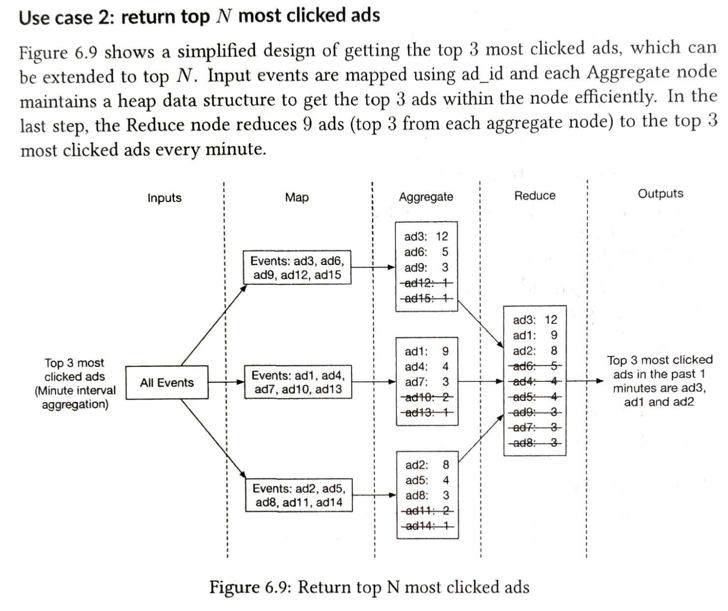
      

  - 

      
Architecture

      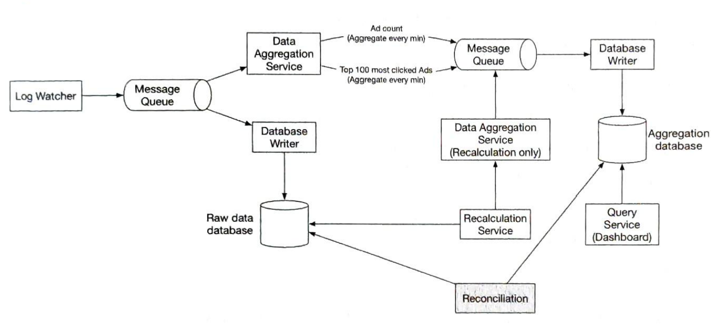
    

- Clarification
- Estimation
- APIs
- Design
## 25. Payment system
## 22. Hotel reservation system
- Design
  - APIs
    - Hotel service
    - Booking service
    - Hotel Management service
    - Rate Service
    - Payment Service
    - Guest/User service
  - Database
    - Considering the relations between tables and need for ACID, SQL is best
    - No need to assign room at the time of booking, keeping an inventory count in booking is best for performance. 
    - Table
      - Hotel
        - Room
        - Hotel
      - Booking
        - booking
        - inventory
          - room_type_id
          - date
          - total_slots
          - booked_slots
    - Concurrency
      - Locking mechanism
    - Scaling
      - Shard based on hotel_id
- Architecure
  - 

      
Sharding

      
    

  - 

      
Architecture

      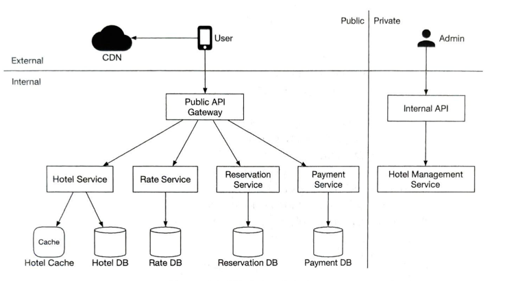
    

## Distributed Locking
- What is fencing token? 
  - Use it to make sure only eligible node releasing the lock.
  - 

## Processing
- Apache Parquet 
  - is an open source, column-oriented data file format designed for efficient data storage and retrieval. It provides efficient data compression and encoding schemes with enhanced performance to handle complex data in bulk.
- Columns store data or similar data compression
  - Dictionary encoding bitmap encoding

## Huge historical data, irrelevant
- Do "Sub Sampling" to take periodic portions of data 
- Archiving solution ( historical DB, move to S3/AWS glacier)

## Job Scheduler
- https://youtu.be/WTxG5880EH8?t=321

1. **Design a social media platform:**
    - Scalability, high availability
    - Data storage and replication
    - User authentication and authorization
    - Message delivery and real-time updates

2. **Design a content delivery network (CDN):**
    - Scalability, geographic distribution
    - Content caching and optimization
    - Load balancing and efficient routing
    - Delivery of static and dynamic content

3. **Design an e-commerce website:**
    - User authentication, payment processing
    - Product catalog, search and filtering
    - Order management, inventory handling
    - Real-time order tracking and updates

4. **Design a real-time chat application:**
    - Scalability, low latency
    - User authentication, message delivery
    - Real-time updates, group chat features
    - Data persistence and synchronization

5. **Design a distributed system for handling large amounts of data:**
    - Data partitioning and replication
    - Fault tolerance and consistency
    - Load balancing and scalability

## Problems

| Problem Description                       | Occurrence |
|-------------------------------------------|------------|
| Failed to mention NFR during requirements | 3          |
| Missed to list all endpoints              | 2          |
| Missed schema                             | 1          |
| Mention LB type ( active-passive)         | 1          |
| Failed to go through flow                 |            |
|                                           |            |
|                                           |            |
|                                           |            |
