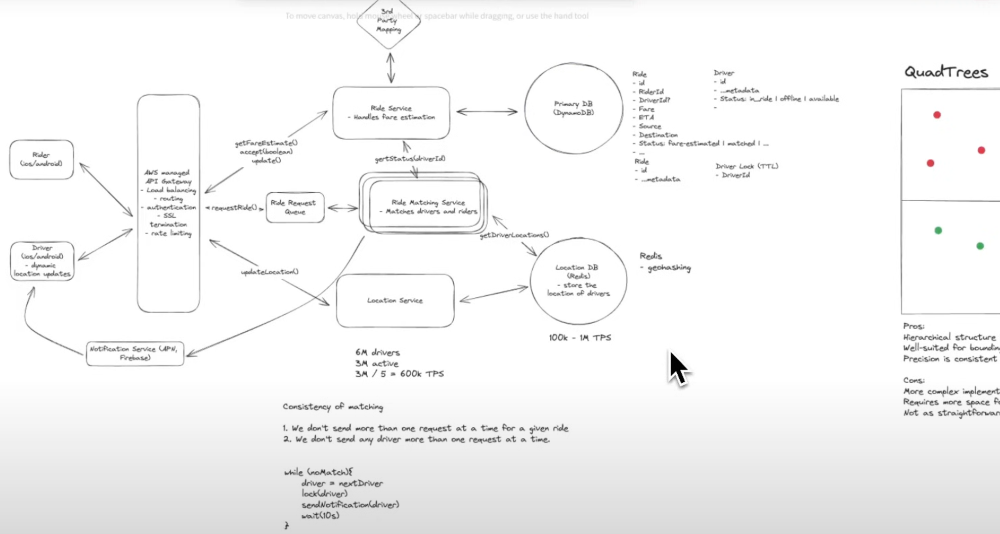
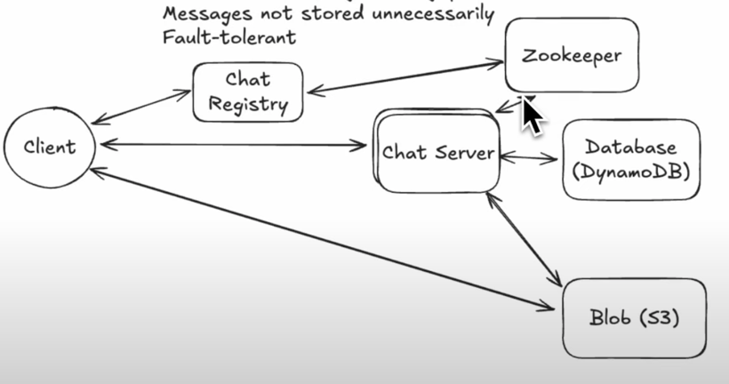
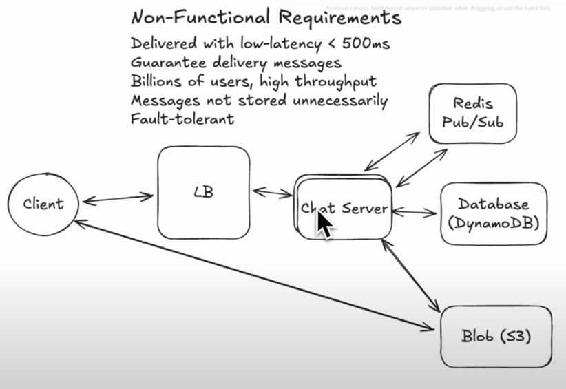
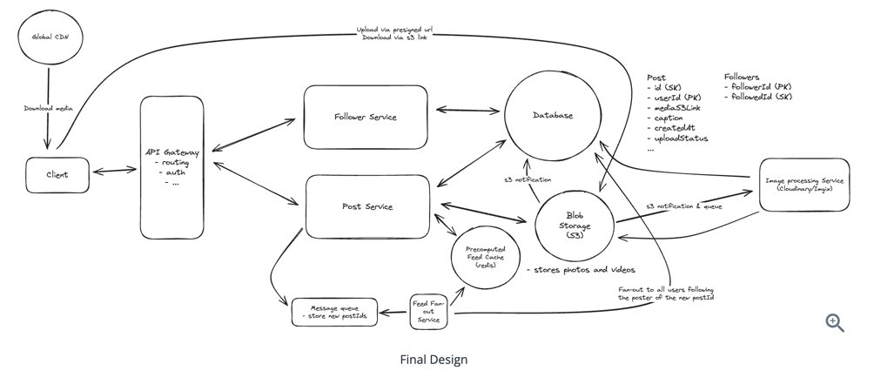
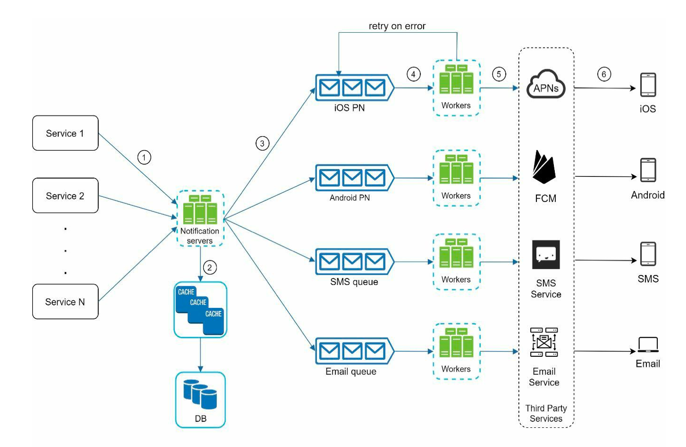
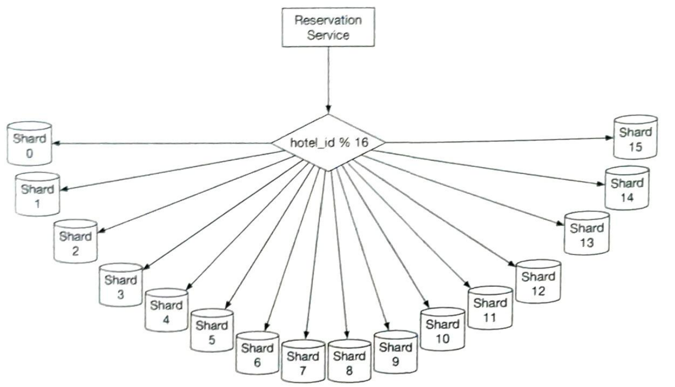

# Problems

## Common problems

|    | Problem                         | Attempted          | Confident | Key Concepts                                                        |
|----|---------------------------------|--------------------|-----------|---------------------------------------------------------------------|
| 1  | Distributed Metrics/Logging     | :x:                | :x:       | - Distributed Systems - Logging - Metrics - Event Sourcing |
| 8  | Notification System             | :white_check_mark: | :x:       | - Notifications - Pub/Sub - Distributed Systems               |
| 10 | Chat                            | :white_check_mark: | :x:       | - Real-time Messaging - Websockets - Pub/Sub                  |
| 12 | Youtube                         | :x:                | :x:       | - Video Streaming - Content Delivery - Recommendation Systems |
| 2  | Rate Limiter                    | :white_check_mark: | :x:       | - Rate Limiting - Distributed Systems                            |
| 6  | URL shortener                   | :white_check_mark: | :x:       | - URL Shortening - Hashing - Redirects                        |
| 7  | Web crawler                     | :white_check_mark: | :x:       | - Web Crawling - Distributed Systems                             |
| 9  | News feed system                | :white_check_mark: | :x:       | - News Feed - Social Networks - Algorithms                    |
| 11 | Search autocomplete             | :x:                | :x:       | - Search Algorithms - Autocomplete - Data Structures          |
| 13 | Uber                            | :white_check_mark: | :x:       | - File Storage - Cloud Storage - Distributed Systems          |
| 5  | UID generator                   | :x:                | :x:       | - Unique Identifier - Distributed Systems                        |
| 28 | Job Scheduler                   | :white_check_mark: | :x:       |                                                                     |
| 14 | Swiggy/Doordash                 | :white_check_mark: | :x:       | - Food Delivery - Geolocation - Order Management              |
| 15 | Kids safety                     | :white_check_mark: | :x:       | - Child Safety - Parental Controls - Monitoring               |
| 16 | Proximity service               | :x:                | :x:       | - Proximity Detection - Location-based Services                  |
| 17 | Nearby friends                  | :x:                | :x:       | - Location Sharing - Social Networks                             |
| 18 | Google map                      | :x:                | :x:       | - Maps - Geolocation - Routing - API                       |
| 4  | KV store                        | :x:                | :x:       | - Key-Value Store - NoSQL Databases                              |
| 20 | Metrics Monitoring and alerting | :x:                | :x:       | - Monitoring - Alerting - Distributed Systems                 |
| 21 | Ad click event aggregation      | :white_check_mark: | :x:       | - Ad Tech - Event Aggregation - Analytics                     |
| 22 | Hotel reservation               | :white_check_mark: | :x:       | - Reservation Systems - Booking Platforms                        |
| 23 | Distributed Email service       | :x:                | :x:       | - Email - SMTP - Distributed Systems                          |
| 24 | S3 like blob storage            | :x:                | :x:       | - Object Storage - AWS S3 - Distributed Systems               |
| 25 | Payment                         | :white_check_mark: | :x:       | - Payment Gateways - Transactions - Financial Systems         |
| 26 | Digital wallet                  | :x:                | :x:       | - Digital Payments - Wallets - Cryptocurrency                 |
| 27 | Stock exchange                  | :x:                | :x:       | - Stock Trading - Financial Markets - Exchange Platforms      |
| 19 | Distributed Message Queue       | :white_check_mark: | :x:       | - Message Queues - Pub/Sub - Distributed Systems              |

## 2025

| System Design Problem   | ✅ Read | 🧪 Self Mock | 🎤 Mock Interview |
|-------------------------|:------:|:------------:|:-----------------:|
| Bit.ly                  |   ✅    |      ❌       |         ❌         |
| Dropbox                 |   ✅    |      ❌       |         ❌         |
| Gopuff (Local delivery) |   ✅    |      ❌       |         ❌         |
| Leetcode                |   ✅    |      ✅       |         ❌         |
| Ticket Booking system   |   ✅    |      ❌       |         ❌         |
| Twitter                 |   ✅    |      ❌       |         ✅         |
| FB News Feed            |   ✅    |      ❌       |         ❌         |
| Tinder                  |   ❌    |      ❌       |         ❌         |
| WhatsApp                |   ✅    |      ❌       |         ❌         |
| Yelp                    |   ❌    |      ❌       |         ❌         |
| Strava                  |   ❌    |      ❌       |         ❌         |
| FB Live Comments        |   ✅    |      ✅       |         ❌         |
| FB Post Search          |   ✅    |      ❌       |         ❌         |
| Instagram               |   ✅    |      ❌       |         ❌         |
| YouTube Top K           |   ❌    |      ❌       |         ❌         |
| Uber                    |   ✅    |              |                   |
| Robinhood               |   ❌    |      ❌       |         ❌         |
| Google Docs             |   ❌    |      ❌       |         ❌         |
| Distributed Cache       |   ❌    |      ❌       |         ❌         |
| Web Crawler             |   ❌    |      ❌       |         ❌         |
| Ad Click Aggregator     |   ✅    |      ❌       |         ❌         |
| Auction System          |   ❌    |      ❌       |         ❌         |
| Rate limiter            |   ❌    |      ❌       |         ❌         |

## Problems from interview experience

- Payment?
- Infra
    - Ad Click Aggregator (More common for Infra)
    - Memcache (1% of the time, E4 will be asked this like an unfortunate candidate did a few days ago...)
    - Top K Heavy Hitters (More common for Infra)
    - Botnets (And 5% of the time, it's an actual webcrawler. More common for Infra)
    - Online Chess (Not frequently asked but yikes, it's a hard one)
    - Design FB Privacy Settings (More common for Infra)
    - Design FB Live

- [x] Design web crawler
- [x] Design online chess
- [x] Design whatsapp
- [x] Design price alert system similar to camelcamelcamel.com
- [x] Design proximity server.
- [ ] Design a system to store images for FB and insta that would require 1000 uploads per sec and handle duplication.
- [x] Design YouTube
- [x] Design the Facebook post privacy functionality. In other words, if I make a Facebook post, and I have 3 privacy
  options to choose from (Only Me, Friends Only, Public), design how wold you get the visibility for any Faceook user (
  ie. can a FB user see the post or not)
- [x] Design an online judge like leetcode
- [x] Video count in distributed system.
- [x] Design Ticketmaster.
    - More focus on:
    - Ticket booking workflows
    - What if tickets are not available?
- [ ] Netflix
- [ ] Yelp
- [ ] Instagram
- [ ] design messenger status
- [ ] Google drive
- [x] Ad count aggregation system (picked product architecture, but ran very similar to typical system design question).
  Provided both live data case and accurate data case with both CMS and persistent data storage. honestly I am not sure
  about this round.
- [x] Top 10 songs played on spotify (top-k problem)

- TAG management (https://leetcode.com/discuss/interview-experience/4351482/Design-a-tagging-system-or-HLD-or-LLD)
- File download (https://leetcode.com/discuss/interview-experience/1263830/Facebook-product-design)
- Apply discount on Nth
  order (https://leetcode.com/discuss/interview-question/system-design/459593/Facebook-or-System-Design-or-E-commerce-Apply-discount-on-every-nth-order)
- Design Leaderboard ( Bharath )
- Realtime gaming
  ranking (https://leetcode.com/discuss/interview-question/system-design/625918/Amazon-or-System-Design-or-Design-a-real-time-gaming-ranking-system)
- Distributed counters
- System to give prices of
  stack ( https://leetcode.com/discuss/interview-question/system-design/431712/Bloomberg-or-Design-a-system-to-give-prices-of-a-stock )
- Design FigJam/Miro

## Tips

- Clarification
    - If the problem is too big, get the feedback on what I have to focus.
    - Make sure to check if interviewer can follow you up.
    - Make sure to check if you are going in the right direction.
- Database
    - Don't talk anything about database during estimation, clarification and initial design
    - Talk about engine selection for indexing type based on read or write
      heavy ([Engine selection for performance](Database.md#performance) )
- When pitching async design or event driven system
    - The design we currently have is synchronous. This is not enough because the capacity of consumers and producers
      are not always equal. If there is a sudden increase in traffic, we can expect more latency.
    - We can adopt message queue to decouple consumers and producers and scale up or down when needed.
- Non functional requirements (NFR)
    - Propose NFR for service level.
        - Example in hotel booking,
            - Booking -> consistency(to handle race condition adn duplicate booking)
            - Search -> Scalability and availability
- Design
    - Initially draw boxes, don't focus on design.

## Twitter

- Use cases
    - Tweet
    - Timeline (Home(following user tweets), User(your tweets and retweets) and Search)
    - Trends

- Read > write
- Eventual consistency
- Scalability
- Storage

- Timeline
    - User timeline ( his own tweets and replies )
        - maintain in redis.
    - Home timeline.
        - main in redis as well but pulled as well. See below.
    - Celebrity
        - pull based -> When a user follow a celebrity, and celebrity makes a tweet nothing happens. Because fanning out
          for 100M user is hard.
        - Whenever user load their timeline, whatever in his home timeline ( from fanout ) and get his followers one by
          one and pull their tweet concurrently and lazy load(add t to response or push it to his home timeline).
    - Non celebrity
        - fan out to push tweets from user timeline to home timeline of his followers.
        - But its not possible for celebrity as its hard to do.
- Trends
    - 1000 tweet in 5 min > 10000 tweet in 1 month. ( should be like a rolling window so that when its out of trend, its
      handled as well)
    - Region based trends also needs to be handled.
    - Logic ( all these services are connected by a queue)
        - Filtering service to filter common boring tags like food, fun, funny etc and remove violating content.
        - Parse -> parse all valid hashtags for use and remove useless tags, if no tags possibly build tags with some
          NLP.
            - Geo processing service -> find location of tweet and group by location, example #rugby maps to usa when
              rugby match happen in USA
                - count location -> this will find what location trends what hash tag.
            - Trending processing service -> maintain window and count hastags
                - Rank service -> to rank each hashtags.
            - Outcome of above data is writted to a data store from which its queried.
- Search
    - Inverted index from tweets.
    - Filter same as above before indexing.

## Ticket master

- Use cases
    - View event
    - Search event
    - Book tickets
- NFR
    - Scalability
    - Consistency for booking
    - Low latency
    - High availability -> Search and viewing events
- HLD
    - Search service to search event
    - Event crud
        - this will provides tickets and not search
    - Booking ( reserve and confirm )
        - Redis lock for reserve. -> if lock goes down, still it wont affect the system as DB is consistent but who
          reserve their ticket might lose theirs.
    - DB postgres
- Deep dives
    - Scale search
        - Introduce search optimized DB
        - Elastic search -> use CDC to update events or even Event crud can write it here.
        - enable node query cache(a cache in all instance/shards) for faster reads since data wont change often.
        - Or cache hot search terms to CDN
    - Scale event crud.
    - Avoid double booking.
    - Read time seats -> SSE to push seat updates. -> open connection, server can push events.
      
    - User experience

## Uber / Lyft

- FR
    - User request drive
    - System find matching drivers
    - Drivers accept ride
    - Drivers update their locations
- NFR
    - Consistency -> Booking
    - Availability -> ride request
    - Scalability
    - User Experience
- APIs
    - Entities here
        - Customer
        - Driver
        - System
        - missed -> Ride and Location
    - POST /v1/ride -> this should be patch on ride.
        - Body
            - source and dest
            - time
            - customer id
    - missed -> fare-estimate, patch on ride from driver side and patch/driver/driver/update -> to stamp pickup, drop,
      arrived during ride.
    - Location DB can be postgres and postgis which supports quad tree but geohash is better as its simple and easy to
      search and prefix based allows retrieval of nearby, uniform distribution of hash values.
    - Push notification from ride matching.
- Deep dives
    - Location update of driver
    - Location search
    - Avoid double booking.
        - Simpler approach is to make sure
            - Don't send more than 1 ride request per driver.
            - Don't send more than 1 request to any driver.
            - Simpler solution is to add column in table for driver status ( assigned, request sent) but it wont expire
              after 5 sec window(for driver to accept/decline).
            - So better option is to set driver id with TTL 5s, rider matching service can use it to send request to
              drivers.
            - We can keep location data and driver data in one redis as well.
    - Scale -> add ride request queue before ride matching service
- 

## Facebook News feed

- Use case
    - create posts
    - view posts
    - feed ->user timeline, home timeline.
        - ordered by cronological order
    - follow
      Questions
    - How many users
    - maximum followers? -> 1M
    - Comments, react to posts?
    - Assume authN and AuthZ is taken care.
    - What is a post?
        - Media?
        - text -> limit? -> 100000 words
        - links? ( preview for links)
- NFR
    - Scalability
    - Availability > consistency
        - Read after write consistency for post creator
    - Low latency

### FB live comments

- Use case
    - Post comments
    - See stream of comments ( notifications )
    - Old comments? ( top/bottom scroll )
- Questions
    - What is a comment? -> text, links, limits, media?
    - Reaction to comments?
    - AuthZ and AuthN taken care.
    - chronologically ordered by time.
    - Assumption -> video streaming is already taken care.
- BOE
    - Number of users
    - Max can watch video
- NFR
    - Availability > consistency
    - Infinite scroll?
    - Scalability
- API
    - POST v1/comment
        - { video_id, comment }
    - GET v1/comments
        - { video_id, offset/cursor details }
- Deep dives
    - How to scale
    - SSE, connection needs to be established, how to make sure, comments reach user regardless of which server he
      connects to?
        - websocket is not a good option here because
            - Initiate HTTP handshake then upgrade to WS. So,
            - It uses its own protocol.
            - Websocket has to be passed through API gateway, so support needed multiple layers.
                - Some support but it has a cost, not a cheap option and complex.
            - Not any reads as writes to make it bidirectional.
            - Not everyone is a commenter.
            - Also in case of a server crash, thundering herd problem to re-establish all connections.
        - SSE
            - uni dir
            - Browser has built in support to re establish connection
            - Its just like a long running HTTP req
            - Doesn't require anything fancy.
            - SOme API gateway also doesnt support SSE well, little tweaks reqreuired to make sure API doesnt close this
              by default
    - Redis pub/sub between comment service and messaging service which maintains SSE connections
        - But limitation here is redis is fire and forget, so old messages cannot be retrieved/replayed.
        - In such scenario, need to rely on DB call.
        - Pagination -> cursor better than offset as no need to count previous rows.
        - kafka vs redis needs to be explained. Kafka is not suitable here because lot of overhead for subscribe and
          unsubscribe.
        - redis pub sub makes it easier and faster, no durability though.

-
- I know at this point, we have to BOE, its my pref I forego them for now and come back if it influence my design.

## Ad click aggregator

- Clarifications
    - ads are displayed in websites
    - SDK for clients
    - ads are created and managed.
    - Real time / near real time? -> 1 mins
- Use case
    - Aggregate ads
    - Analytics on aggregated data
        - Query dimenstions: time, ad, region and domain
    - Out of scope
        - Ad target?
        - Managing ads
- BOE
    - Number of ads -> 1M (10^6)
    - Clicks per day -> 1B ( 10^9)
    - read ~ write ( optimize read and write separately )
    - TPS -> (10^9)/(10^5) -> 10^4
        - Burst 10^5
- API
    - POST /v1/click
    - ad_id, timestamp, user, location
    - GET /v1/analytics?...
- NFR
    - Liteness & Low latency ( Application shouldn't feel the load to write ads )
    - Scalability
    - Accuracy -> no double events or duplicate consumption ( in client and server)
- HLD
    - Cassandra and olap(clickhouse and druid) for read and write.
- Deep dives
    - Kafka + stream aggregator like Flink/Spark
    - Flink -> maintains in mem DS and specify aggregate window and write roll up data to OLAP
        - Flink flush interval -> if 10 sec, every 10sec
        - Flush intervals help you to prepare data for graph granular time slots.
    - What happens in new ad? Hot shards / hot partitions -> how to avoid?
        - celebrity problem -> add 0-n to partition key
    - Fault tolerance -> What if consumer flink jobs is down?
        - Retention policies needs to be in place.
    - Dump events to S3 for periodic reconciliation
        - consume and process it to fix potentially incorrect records.

## Leetcode

- Check excalidraw
- Feedback
    - HLD
        - No need to decouple all services in the first go.
    - Time complexity for sorted set is O(n)
    - api
        - Missed get problems
        - view problem
            - missed api filters
        - path param /problem/:problemId
    - Deep dive
        - what is written to DB but failed to write to redis? -> CDC
        - No of containers less -> introduce queue
        - Now we made submission async -> how he knows the result ?
        - Worker can consume and run code on containers and pass it to primary service
            - Can it directly write ot DB?
              

## Whatsapp

- Usual FR & NFR
- Talk about storage
- Encryption OOS
- Deep Dives
    - Websocket management
        - Use Layer 4 LB, in L7(http level because webs servers are stateless) connection is terminated after call.
          Client to LB 1 connection and LB to chat server symmetric connection
    - Routing messages to chat server and finding chat server that holds connection to the recipient is hard.
        - 
        - During scaling event, consistent hashing occasional re-mapping might happen during scale up/down, at that
          time, messages has to be retried twice.
        - REDIS pub sub to decouple communication between chat servers.
            - Kafka is not a right choice as topics are heavy and it's not built for spinning up millions of topics
              dynamically.
            - REDIS pub/sub gives at most once guarantee(which is low guarantee, but we have message stored in DB, as
              long as we have a reliable way to deliver missed messages, its good).
            - Client can periodically poll DB for missed messages and redis provides low latency.
            - Multiple redis cluster to maintain connections
        - Cleanup -> unread messages after 30 days
            - Periodically clear read messages
        - Device ID -> messages should be delivered in multiple devices.
    - DB design
    - Fan-out  
      

## Instagram
- Fanout + Dropbox
- Deep dives
  - Fan-out
    - Fanout-on-write for the majority of users (follower count < 100,000)
      Fanout-on-read for the few "celebrity" users (follower count > 100,000)
  - Render photos and videos instantly ( large files )
  

## Youtube Top K
- 

## Tinder
- User can create preferences ( location, age, gender, etc.)
- View stack of potential matches based on pref.
- swipe left/right 
- 2 users swipe right -> send notification
- constraint 
  - Avoid showing repeat profiles
- oos
  - create profile
- NFR
  - Consistency 
  - 

## FB post search
- 

## Old -> clean below

## 1. Distributed Metrics/Logging

- Use message broker
    - In memory message broker Vs Log based message broker
    - Stateless consumers
    - Time based aggregation
        - Aggregation windows
            - Tumbling windows - Fixed length and fixed start time, non overlapping i.e start of every minute.
            - Hopping window - 0-5, 1-6, 2-7 etc, overlaps.
            - Sliding window - Maintain LL to find for any range
    - Logs can be moved to S3
    - You cannot do data processing from S3, so need to move it to Hadoop cluster and run spark on that data.
    - Spark is a batch processing service widely used, better than map reduce
        - Supports complicated processing and format sot hat you can throw to data warehouse

  

    
Architecture

    
  

## 2. Rate Limiter

- Clarification
    - Missed API key part
    - Fixed window or Rolling window
    - Assuming it's a separate service instead of application code.
- Requirements
    - Missed NFR
        - Fault tolerance on rate limiters.
        - Super low latency since it's an over head on processing the request.
- API
    - Missed endpoint_name in request
    - Missed time stamp.
- Estimation
    - 1 million user
    - rate limiting factor ( user id/ API key ) - 8 bytes
    - 4 byte time stamp
    - 4 byte counter
    - 1mil * 16 -> 16 MB
    - Memory shouldn't be a problem, still we can partition to improve speed and fault tolerance.
- Design
    - Fixed window
        - Map with user id as key and tuple as value ()
    - Rolling window
        - Maintain list or sorted set for user in redis. ( treat it like linked list )
            - Keep pushing the data and let the cron job delete state data
        - Use small sized fix windows ( like batches )
    - Cache some information in LB/API gateway to reduce load on rate limiting servers
        - Use write back cache to sync with rate limiting services.
        - High availability, ALl writes to go to same place -> Single leader replication
    - Fault tolerance
        - If master fails, we can restart with a little loss. if not we can go with lower consistency
    - You can talk about algorithms
        - Leaky bucket
        - Token bucket
- Database
    - Partition on user id/IP/API key
    - Partition on has above and use range based partition

  

    
Rate Limiter Architecture

    
  

## 6. Tiny URL / Pastebin

- Clarification and Estimation
    - Clarification
        - How long is the shortened URL? - Clarification
            - If they as short as possible, we should define length to avoid collision.
            - Chars allowed in hash
                - Chars - a, A 0-9 => 10+26+26 = 62. So 62^n combinations possible
            - Find smallest n such that 62^n < total URL writes ( 365 billion )
        - URL deleted/updated?
        - NFR
            - Missed NFR, never talked about Availability, Consistency and Fault tolerance
        - Never mentioned read or write heavy -> mention "READ > WRITE need to optimize this"
- Problems/Critical part/Deep dives
    - Address if we are going to create a unique ID and assign it to column (id, short URL hash, long URL) or search
      just hash
    - How to make long hashed value short from sha/MD hash
        - 

              
Hash Shortening

              
          

        - Hash + Collision resolution ( Hashed short URL needs to be verified if it exists in the system. Its costly
          process )
            - So use Bloom filters(A bloom filter is a space-efficient probabilistic technique to test if an element is
              a member of a set).
            - In case of collision
                - Chaining
                    - Not possible to store LL in DB
                - Probing
                    - Or 32fz18 -> try next 32fz19 and so on.
        - Base 62 conversion ( represent values based on 0-9, a-z, A-Z => 0-61 base)
    - Redirection ( browser http status 302)
    - Database
        - Partitioning
            - by range
                - Shard based on hash/short URL first char. a-d, e-h, i-s, t-z. This will relatively work since key is
                  already hashed and this will be evenly distributed.
            - Consistent hashing for hash/short URL
        - Lock rows when writing an entry(short and long URL)
          -
                1. Predicate locks to lock row that doesn't exist. (Costly but indexing short URL will make it faster)
            -
                2. Create all precomputed hashes and use them.
        - Indexing types ( what engine to use)
            - Since read heavy use B-Tree. ( Look [engine selection](Database.md#performance) )
        - DB choice
            - Single leader, partitioned and Btree based -> MySQL, Postgres
            - Mongo DB could make an argument but above make sense considering the simple data model.
    - Read speed
        - Caching for hot links. Partitioning the cache by shortURL lead to fewer cache misses.
            - Write ahead cache suitable option.
            - LRU eviction
    - Pastebin
        - Use S3 to store blob and everything else is same.
        - Write will be 2 phase commit to store in MySQL/Postgres and S3.
    - Extras
        - Analytics
            - column for clicks ( address race condition without locks )
            - Kafka. So use log based message broker to aggregate later (no need for DB or in memory message broker).
            - Spark streaming with mini batch since no real time required.
        - Delete expired jobs
            - Use batch jobs with CRON
    

        
Tiny URL/PasteBin Architecture

        
    

- Mentions
    - Monotonically increasing sequence is not a good idea since locking and indexing performance.
    - 

          
Replication strategy

          
      

## Web Crawler

- Requirement
    - Given a set of URLs, download all the web pages addressed by the URLs.
    - Extract URLs
    - Add new URLs to the download list.
- Clarification
    - Content type
    - Raw data storage required?
    - Do we need to handle duplication?
    - How frequently we need to check for updates
        - Manage frequent updates/low frequent updates.
- NFR
    - Scalability
    - Robustness ( broken links, malicious links, corrupt html, server errors, crashes etc.)
    - Politeness - Don't put too much load into the servers, controlled crawling.
    - Extensibility ( to support new file formats in future)
- Estimation
    - Pages per month
    - QPS
    - Peak QPS

- High level Design
    - 

        
Architecture

        
      

- Deep dive
    - BFS vs DFS
    - BFS is best and have separate queue for group of URLs based on consistent hashing
    - Prioritizer on top of queue to fetch most important page to be crawled first.
    - Detect and avoid problematic content
    - Robustness
        - Retry
    - Robot exclusion protocol ( robots.txt)
    - Distribute crawls
    - Cache DNS resolver since it's a bottleneck for crawlers
    - Geo routing of crawl request to crawlers to fetch from nearby IP.
    - 

        
Architecture

        
      

    - Ignore uselss data in content parser (ads, spam urls etc)

## 8. Notification System

- Requirements
    - Type of notifications
        - Push, sms and email
    - Real time?
        - Ideally these systems are soft real time, as soon as possible with slight delay when systems are on load
    - What triggers them?
        - Client applications and scheduled on server sides.
    - User opting out
    - Group pushing events.
    - Priority.
- Clarification
- Estimation
    - Notifications per day
- High level design
    - Cache user info, device info and notification templates.
- Deep dive
    - Group pushes, batch processing.
    - Prevent data loss
    - System failures
    - Maintain notification log.
    - Receive notification only once.
    - Retry
- Architecture
    - Don't forget to maintain notification log.
        - To understand common failure pattern for analytics.
        - Possibly in push notification, we can track user patterns as well.
    -
    - 

        
Architecture

        
      

    - 

        
Architecture

        
      

    - 

        
Architecture

        
      

    - 

        
Architecture

        
      

    - 

        
Final Design

        
      

    - 

        
Alternate Final Design

        
      

## 9. News Feed System

- Requirements
- Clarification
- Estimation
- High level design
- Deep dive
    - Fanout service
        - Fanout on write
            - When news/post written, its pushed to friends cache immediately.
            - Feels real time and fast. But Resource intensive(especially when user has many friends and user is not
              going to read i immediately)
            - Little lazy loading can be better based on user activity.
        - Fanout on read
            - News feed computed on read and
            - Best for inactive users
        - Hybrid approach is better based on activity history/pattern

- Architecture
- 

     
Final Design

     
   

- 

     
Final Design

     
   

## 12. Youtube

- Requirements
    - Watch videos
    - Upload videos
        - Encryption?
        - Size?
    - Like/Dislike
    - Playlists?
- Clarification
- NFR
    - Watching
        - Availability
    - Upload
        - Availability
        - Integrity and Durability
- Estimation
    - DAU
    - Average time spent per user
    -
- High level design
    - Everything else except viodeo streaming goes through API servers.
- Deep dive
    - Geo distribution is important
    - CDN is important
- Architecture

## 13. Drive/Google Drive/Box

- Requirements
    - Upload file
    - Download file
        - Size limit
        - Files need to be encrypted? -> stretch
    - Share file
    - Users
        - Storage size
    - File versioning
    - File preview
    - Search?
    - NFR
        - Durability of uploaded files ( replication and geo distribution )
        - Availability > consistency ( eventual )
        - Scalability
        - Data integrity ( use checksums to verify uploaded files)

- Estimation
    - Read > Write
    - numbers here.
- High level design
    - File service
    - Store file content and file metadata separately.
    - Upload directly to blob store using pre-signed URL
    - FIle status in metadata should handled once upload completes.
- Deep dive
    - Upload
        - To upload data by chunks in BD.
            - Define chunk size by bandwidth, IO capacity, server capacity etc.
        - Use checksum or hash to verify data integrity.
            - This checksum can be checked incrementally so no need to keep all chunk checksum in memory, verify only
              final checksum/hash.
        - Split compress, encrypt order and store data.
        - Resumable upload for really large files.
            - Continue from last chunk.
    - Download
        - Download in chunks so retry is possible
        - Frequently downloaded files, 80/20 rule is applicable, CDN can be a solution here.
            - Invalidation mechanism and TTL in header to keep it efficient as CDN is costly.
    - Share
        - Share info can be part of separate table or same file metadata table depends on maximum people you can share
          with.
    - Sync
        - local to cloud
            - SDK to monitor local changes and upload chunks
        - cloud to local
            - SDK to consume cloud changes and download chunks
        - Only sync delta chunks.
        - Conflicts
            - LWW
- Architecture
- 

    
Region replication

    
  

- 

    
Region replication

    
  

- 

    
High Level Design

    
  

- 

    
Final Design

    
  

## Ticketmaster

- Requirements
    - City => Movie => Theatre => Time => seats
    - If seats are available, reserve them until booking.
    - If reserved, join FIFO wait list queue to take over if booking was dropped.
- Clarification
- NFR
    - High consistency (ACID)
    - Atomicity -> all or nothing
        - Need to implement reserving in section level instead of seat level since seat level is complicated.
            - May be allow number of seat booking in a section without selecting seats ( just specify number of seats )
    - Concurrency control
- Estimation
    - 500 cities, 10 theatres , 2000 seats, 2 shows per day.
    - 2000000 tickets
    - 24 bookins per sec
    - Booking at peak 250/sec
    - 50 bytes per booking data => ?
- API
    - GET cities, Theatres, shows with times, seats
    - POST booking
    -
- High level design
    - No to Nosql since we need transactions and concurrency control
    - Keep linkedhashmap and provide booking id during reserve/blocking seat itself and release the if seats are freed.
- Deep dive
    - Race condition
    - Seat blocking
    - All seat or nothing
- Architecture

## Proximity Service

- Requirements
- Clarification
- Estimation
- High level design
- Deep dive
- Architecture
- 

    
Proximity

    
  

## Dummy

- Requirements
- Clarification
- Estimation
- High level design
- Deep dive
- Architecture

## Dummy

- Requirements
- Clarification
- Estimation
- High level design
- Deep dive
- Architecture

## 10. Chat/Messenger

- Estimation
    - 500 million users, 40 message per day
    - 100 bytes per message
    - 20 billion message per day
    - 2TB storage per day
    - 3.5PB storage per 5 years

- Requirements
    - Group chat
    - Send and receive message in real time
    - Keep old messages in DB
- Design
    - Database
        - User
        - Chats (chat id, time stamp etc)
        - UserChat (userId, Chat ID) -> index both => to see list of chats.
        - Message table (chat id, message, timestamp)
        - NoSQL is best
            - Ton of writes ( cassandra best for writes and schemaless)
            - Cassandra uses leaderless replication
    - Long polling not a good option since we need reset header every time.
    - When chat server goes down, we need to allocate different server to handle user connection.
        - Reestablish handshake when a chat server goes down cause thundering herd problem. Might cause cascading
          failure.
    - Because of above reasons, server sent events are best since they reestablish connection when disconnect when
      websockets don't.
    - For group messages
        - No need for distributed transaction since they are not that important, and we can rely on eventual consistency
          since some of them might be offline.
        - First need to upload message to DB and then distribute to all members or send concurrently also.
    - Ordering of messages
        - Everyone see all the messages in same order or the order at which they are processed?
            - Use timestamp on the device that sent a message or timestamp on the server that receives the message?
            - Timestamps are not perfect, but at least we can make it consistent
- 

      
Chat Main Architecture

      
  

- 

      
Chat Architecture

      
      
  

## 19. Distributed Message Queue

- Check [Message Broker](Concepts.md#messaging)
- Clarification
    - Durable queue
    - Push message
    - Consume message (pull/push)
    - Message
        - Size limit?
        - Structured/Unstructured?
        - Media?
    - Consumer acknowledge mechanism
    - Order of pushing and consuming same?
    - How many producers and consumers?
    - Message consumed by multiple consumer?
    - Delivery semantics
        - At most once, at least once, exactly once
- NFR
    - High throughput / low latency
    - Scalable
    - Persistent
- Estimation
    - Sc
- Design
    - To achieve throughput
        - Go with SSD or sequential disc access approach after defining message data structure
        - Small I/O is a hurdle to achieve high throughput, so use mini batching.
    - Zookeeper to store list of partitions and its servers.
    - Storage
        - Database (Message as SQL rows / NoSQL) / WAL ( write ahead logs ) which is basically a file with sequential
          access pattern to increase speed.
        - WAL log files on disk is better choice.
        - For metadata storage use zookeeper
    - Routing layer between producer and broker to redirect to sharded broker
    - Broker will be replicated with a single leader
        - To guarantee durability, acknowledge back to producer only after all broker replicas persisted message.
    - Consumer pull vs Push model
    - Coordinator to organize and discover consumers.
    - Failure recovery
        - When broker node crashes, look [Message Broker](Concepts.md#messaging)
    - Increase/Decrease paritions
    - Delivery semantics
        - At most once, at least once, exactly once
            - Send `ACK=1` or `ACK=all` with request(possibly as a header) to handle it in queue.
            - Exactly once is difficult and expensive.
    - Message filtering
        - Add tags with messages.
        - Consumers can subscribe to tags with broker.
        - Tag filter that sits in broker serve accordingly.
    - 

          
Message broker flow

          
      

    - 

          
Architecture

          
      

## 21. Ad click event aggregation

- Clarification
    - Ad click events as input
        - File/Stream/APIs
    - Supported queries
        - ad clicks for an ad in last M minutes/time range
        - Top 100 clicked ads in last 1/M minutes
        - Support filtering by ad_id, country and category
    - NFR
        - Highly available
        - Accuracy ( strong consistency)
        - Fault tolerance
        - Deduplication of events
- Estimation
    - 1 Billion ad clicks, 2 million ads
    - QPS = 10^9/10^5 sec = 10000 clicks per second
    - Peak QPS = 5x10000 = 50000
- APIs
    - GET /clicks/{id} (ad_id, TimeRange)
    - GET /clicks/top (TimeRange)
    - GET /clicks (Filters)
- Design
    - Data
        - Raw data
            - ad_id, timestamp, region, user_id, ip
            - Not going to be queried
            - write heavy
        - Aggregated data
            - ad_id, minute_in_long, count, filter_id (multiple ad_id can exist to fast filtering)
            - filter_id, region, ip, user_id
            - will be queried
            - read heavy
    - Database
        - Cassandra ( time series ) / TimeScale DB
            - Fast write since it uses LSM tree + SS table for indexing
            - Multi leader/leaderless replication 9 (but in this case, we can go for sharded single leader approach for
              ad metrics and for topK we can have a separate shard.)
            - Easy to handle with irrelevant data
    - Aggregation service
        - Apache Flink
            - Uses sliding window approach to calculate data for streams
        - Map reduce ( distributed by moving ad_id % size to respective nodes )
        - 

            
Aggregation of events by Map reduce

            
          

    - 

        
Architecture

        
      

- Clarification
- Estimation
- APIs
- Design

## 25. Payment system

## 22. Hotel reservation system

- Design
    - APIs
        - Hotel service
        - Booking service
        - Hotel Management service
        - Rate Service
        - Payment Service
        - Guest/User service
    - Database
        - Considering the relations between tables and need for ACID, SQL is best
        - No need to assign room at the time of booking, keeping an inventory count in booking is best for performance.
        - Table
            - Hotel
                - Room
                - Hotel
            - Booking
                - booking
                - inventory
                    - room_type_id
                    - date
                    - total_slots
                    - booked_slots
        - Concurrency
            - Locking mechanism
        - Scaling
            - Shard based on hotel_id
- Architecure
    - 

        
Sharding

        
      

    - 

        
Architecture

        
      

## Distributed Locking

- What is fencing token?
    - Use it to make sure only eligible node releasing the lock.
    -

## Processing

- Apache Parquet
    - is an open source, column-oriented data file format designed for efficient data storage and retrieval. It provides
      efficient data compression and encoding schemes with enhanced performance to handle complex data in bulk.
- Columns store data or similar data compression
    - Dictionary encoding bitmap encoding

## Huge historical data, irrelevant

- Do "Sub Sampling" to take periodic portions of data
- Archiving solution ( historical DB, move to S3/AWS glacier)

## Job Scheduler

- https://youtu.be/WTxG5880EH8?t=321

1. **Design a social media platform:**
    - Scalability, high availability
    - Data storage and replication
    - User authentication and authorization
    - Message delivery and real-time updates

2. **Design a content delivery network (CDN):**
    - Scalability, geographic distribution
    - Content caching and optimization
    - Load balancing and efficient routing
    - Delivery of static and dynamic content

3. **Design an e-commerce website:**
    - User authentication, payment processing
    - Product catalog, search and filtering
    - Order management, inventory handling
    - Real-time order tracking and updates

4. **Design a real-time chat application:**
    - Scalability, low latency
    - User authentication, message delivery
    - Real-time updates, group chat features
    - Data persistence and synchronization

5. **Design a distributed system for handling large amounts of data:**
    - Data partitioning and replication
    - Fault tolerance and consistency
    - Load balancing and scalability

## Problems

| Problem Description                       | Occurrence |
|-------------------------------------------|------------|
| Failed to mention NFR during requirements | 3          |
| Missed to list all endpoints              | 2          |
| Missed schema                             | 1          |
| Mention LB type ( active-passive)         | 1          |
| Failed to go through flow                 |            |
|                                           |            |
|                                           |            |
|                                           |            |
