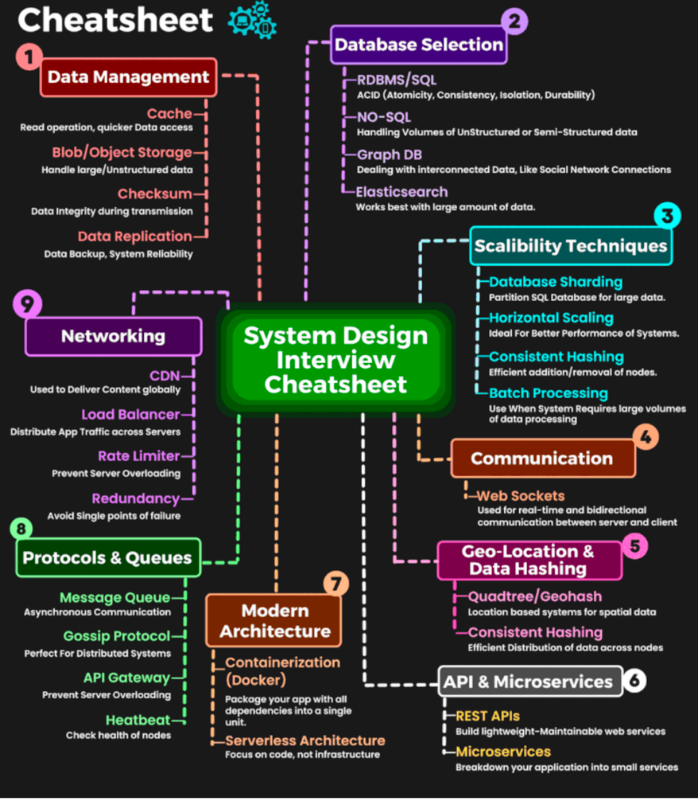

# SystemDesign
> Many think that system design interview is all about a person's technical design skills. It is much more than that. An effective system design interview gives strong signals about a person's ability to collaborate, to work under pressure, and to resolve ambiguity constructively. The ability to ask good questions is also an essential skill, and many interviewers specifically look for this skill.

> Many things in SW engineering is all about trade offs and choices are not always black and white

> CAP theorem considers 100% of C or A or Pbut in real world its about degrees of consistency and availability

  

      
System Design Interview Template

      
  

## 4 steps
1. Understand the problem and establish design scope ( wear product manager hat)
   - Ask clarifying questions, don't make assumptions, If the interviewer ask you to make assumptions, write down assumptions
   - Check if you need back of the end envelope
      - 1 Million req per day = 12 rps
      - 1 Billion rp month = 400 rps
      - 1 Billion rp day = 400*30 rps
      - Numbers
        - 1 Million - 10^6
        - 1 Billion - 10^9
        - 1 Trillion - 10^12
      - Storage numbers
        - 1B - 8 bits
        - 1KB - 1024 Bytes
        - 1MB - 1024 KB
        - 1GB - 1024 MB
        - 1 Billion KB = 1TB
   - Once you clearly draft FR and NFR
- Propose high-level design and get buy-in
   - Come up with an initial blueprint for the design. Ask for feedback. Treat your interviewer as a teammate and work together. Many good interviewers love to talk and get involved.
      - Let the request guide your design
      - Write API for each component?
      - Schema? 
   - Draw box diagrams with key components on the whiteboard or paper. This might include clients (mobile/web), APIs, web servers, data stores.
   - If possible, go through a few concrete use cases. This will help you frame the high-level design. It is also likely that the use cases would help you discover edge cases you have not yet considered.
   - API and schema ->  depends on the problem, for design google search engine not necessary, for multiplayer poker game, it makes sense.
   - LB/any node can be a single point of failure, point it out and suggest solution ( for LB active -passive LB, for services discovery mechanism etc.)
   - Write down what you will be focusing on later as well if possible. 
- Design deep dive
   - Had some initial ideas about areas to focus on in deep dive based on her feedback You shall work with the interviewer to identify and prioritize components in the architecture.
      a. Mention/write NFR for component level here as well.  
   - Add more details to the system(look into news feed system diagram below)
   - Talk about bottlenecks 
   - Look at access patterns and it will give you what to optimize.
   - Common trade-offs : Pull vs Push, in memory vs DB, single vs distributed.
      - Everything decision or tech has a cost/trade off
   - **Talk about Game days to simulate failure in each component and see how can we improve. **
   - Talk about unhappy path. (i.e in uber what if two drivers accept ride, vise versa)
   - Identifying weakness is important. 
   - Do not overcomplicate solution - in uber, when no drivers around, just inform rider about this and ask him to try after sometime.
   - This is basically about how components fit together and solve the use case.
   - Long term thinking is good. 
   - Focus less on mechanics and more on trade offs.
   - Think into the future what doesn't scale well.
4. Wrap up/Evaluation of design
   - Recap the system if necessary
     - Dry run with edge cases/happy/unhappy paths and evaluate if things will work. Consider access patterns as well.  
     - Also assume faults or exceptions in system, wrong order of events in queue, cache down etc. 
   - Error cases (server failure, network loss, etc.) are interesting to talk about.
   - Metrics and error logging
   - How to handle the next scale curve is also an interesting topic. For example, if your current design supports 1 million users, what changes do you need to make to support 10

### Talk about
- Database scaling
- High concurrency
- Failure scenarios
- After choosing database talk about indexing options
- Game day
- Failure scenarios
- Disaster recovery
- Geo Distribution
- Lightweight serialization

### Dos
- Always ask for clarification. Do not assume your assumption is correct. 
- Understand the requirements of the problem. 
- Use standard terminology to save time.
- There is neither the right answer nor the best answer. A solution designed to solve the problems of a young startup is different from that of an established company with millions of users. Make sure you understand the requirements. 
- Let the interviewer know what you are thinking. Communicate with your interviewer.
  - Ask if he has any concerns or questions to understand if he disagrees with you. 
- Suggest multiple approaches if possible. 
- Once you agree with your interviewer on the blueprint, go into details on each component. Design the most critical components first. 
- Convey ideas to the interviewer

### Don'ts 
- "It depends" usually not a great answer when given specific scenario. -> ask clarifying questions and assert an opinion on right choice.   
- Don’t go into too much detail on a single component in the beginning. Give the high-level design first then drills down.
- Communicate. Don't think in silence.
- If you don't know something don't paper over it.

### Time
- Step 1 Understand the problem and establish design scope: 3 - 10 minutes 
- Step 2 Propose high-level design and get buy-in: 10 - 15 minutes 
- Step 3 Design deep dive: 10 - 25 minutes 
- Step 4 Wrap: 3 - 5 minutes

------- 
## General Design template

# Organize

## Redundancy

## Message Queue
- To further scale our system, we need to decouple different components of the system so they can be scaled independently. Messaging queue is a key strategy employed by many real-world distributed systems to solve this problem.
- The basic architecture of a message queue is simple. Input services, called producers/publishers, create messages, and publish them to a message queue. Other services or servers, called consumers/subscribers, connect to the queue, and perform actions defined by the messages.
- Decoupling makes the message queue a preferred architecture for building a scalable and reliable application. With the message queue, the producer can post a message to the queue when the consumer is unavailable to process it. The consumer can read messages from the queue even when the producer is unavailable.
- Partition is a queue
- Consumers
  - Consumers are very lightweight and you can have as many as you want. ( because Kafka maintains offset for each consumer group) 
  - Consumer group with bunch of consumers will not share partitions.
- Retention policy
  - TTL/age limit
- Fault tolerant & durable
- Kafka replicates partitions, so when a broker goes down, backup partition takes over and resume.    

## Logging, metrics, automation
- Metrics: Collecting different types of metrics help us to gain business insights and understand the health status of the system. Some of the following metrics are useful: • Host level metrics: CPU, Memory, disk I/O, etc.
	- Aggregated level metrics: for example, the performance of the entire database tier, cache tier, etc. 
	- Key business metrics: daily active users, retention, revenue, etc.
- Automation: When a system gets big and complex, we need to build or leverage automation tools to improve productivity. Continuous integration is a good practice, automating your build, test, deploy process, etc. could improve developer productivity significantly.

## API performance
- Identify bottlenecks through load tests and profiling requests
- Caching
  - In many layers as possible
- SQL
  - Connection pooling
    - Keep active connections rather than opening a new database connection everytime which involves lots of handshaking.
    - Reuse connections to improve throughput
    - This is a common pitfall in serverless architecture as each serverless components might handle it differently.
    - Tuning the database connection pool size based on the application behaviour. (Large number doesn't always mean more performance)
  - Connection pooling
  - Pagination
  - Purging stale data will improve query performance
  - N+1 problem or tools to identify inefficient queries.
  - Indexing - read heavy or write heavy. 
  - Replication factor and its replication lag. 
- Lazy loading
- Lightweight json serializers
- Payload/response compression will save time
- Asynchronous logging
- Scaling depends a lot on traffic pattern(useful for auto scaling).
- Define P0 flows and turn off p1 flows in disastrous failure.
- Ladder based scaling? 
  - If you expect 1 million QPS, scale for 5 million QPS.
- Failover part
  - Game day/Chaos test to induce failures and see how can we recover.
- Log sampling
- Resiliency
  - Security measures
  - To avoid crawling, use uuid for IDs
  - 
### Organize
- Build confidence by doing game day testing and deliberately fail components and check how the system holding up and if it require any fine tuning/fix.
- SLA agreements by checking SLA latencies(P99, 95 and 50) to improve customer confidence and also know how much you can scale further
- P99 through the roof
- Time stamp in distributed system is not reliable unless we use something like a GPS clock.
- In single thread race condition not possible. 

