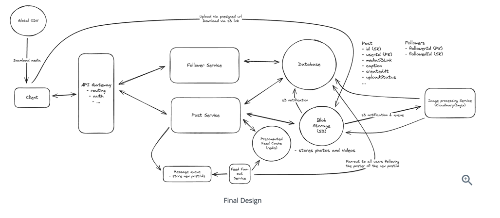
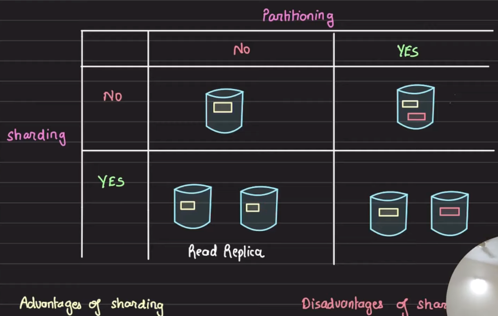

# Sharding

- Horizontal scaling, also known as sharding, is the practice of adding more servers. Sharding separates large databases into smaller, more easily managed parts called shards. Each shard shares the same schema, though the actual data on each shard is unique to the shard.
  - 

        
Sharding

        
    

  - Shards are physical servers, partitions happen on the data part
  - Decide sharding key based on load, access pattern and usecase.
  - A shard can have more than 1 partition
  - 

        
Sharding with Partitions

        
    

  - The most important factor to consider when implementing a sharding strategy is the choice of the sharding key. Sharding key (known as a partition key) consists of one or more columns that determine how data is distributed.
  - When choosing a sharding key, one of the most important criteria is to choose a key that can evenly distributed data.
  - Advantages
    - Handle large reads and writes.
    - Increase overall storage capacity
    - Higher availability
  - Disadvantages
    - Operational complexity 
    - Re-sharding data is hard. 
      - Re-sharding data is needed when
        - A single shard could no longer hold more data due to rapid growth. 
        - Certain shards might experience shard exhaustion faster than others due to uneven data distribution. When shard exhaustion happens, it requires updating the sharding function and moving data around. Consistent hashing, is a commonly used technique to solve this problem.
    - Celebrity/Hotspot Key problem
      - Excessive access to a specific shard could cause server overload. Imagine data for Katy Perry, Justin Bieber, and Lady Gaga all end up on the same shard. For social applications, that shard will be overwhelmed with read operations. To solve this problem, we may need to allocate a shard for each celebrity. Each shard might even require further partition.
    - Join and de-normalization / Cross shard queries
      - Once a database has been sharded across multiple servers, it is hard to perform join operations across database shards. A common workaround is to de-normalize the database so that queries can be performed in a single table.

# Replication
- Advantage
  - Reduce latency
    - Region based replica for read
  - Fault tolerance
- Disadvantage
  - Operational difficulties
  - 
- Replication lag : Time taken to sync all replicas with primary DB
  - Cause inconsistent data at times.
  - Solution (Performance Vs Consistency)
    - Read after write consistency ( synchronous replication ) : Solves consistency problem
      - Primary DB propagate write to all replicas as well and once acknowledged back from replicas, respond success to the call. Caller thas to wait till then. 
      - Slows down writes and performance. More replicas will slow things down. One replica failure to respond will fail the write operation itself.  
    - Asynchronous replication : Solves performance problem
      - Primary DB propagate write to all replicas but don't wait for acknowledgement back. 
      - But if one replica fails to handle write, inconsistent state. 
      - Useful when inconsistencies are OK/updates take time. 
    - Hybrid approach
      - Primary DB propagate write to all replicas, but wait for at least 1 ( this can be 2 or 3 but this is called quorum ) replica to acknowledge back
- How its implemented 
  - CDC ( Change data capture )
    - Running JOB captures DB changes
  - Running 
# Snapshot
- Is different from Replica. 
- It is a snapshot of DB captured at a time.
- Useful when recovery after data loss.