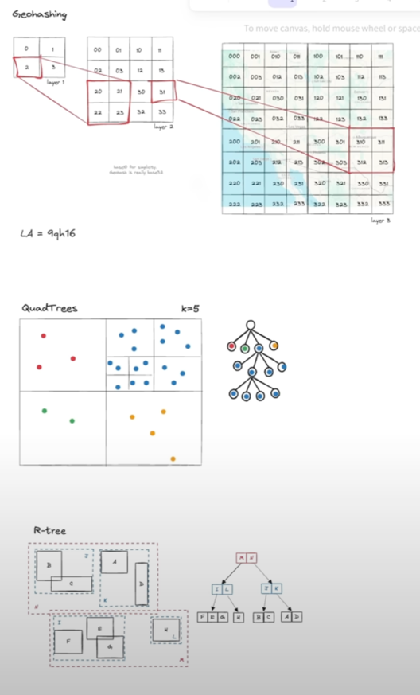

# Technologies for Deep dive

## Kafka
- Topic, Broker, Partition, Producer and consumer. 
  - Broker physical grouping and topic is logical grouping. 
- Event/record
  - Header, key, value and timestamp
- When publishing message, 
  - if it has a partition key it will be sent to that partition, 
  - then message is sent to broker 
  - broker appends message to the partition.
  - offset updated in that partition.
- in case of a broker crash, offset of partition will be lost. So periodically its committed to kafka or if it has consumer group, it can talk to other consumer in the group for latest offset.
- Replication
  - Partitions are replicated as leader and followers.
  - Partitions are replicated across same or multiple brokers. 
  - Leader partition is responsible for handling reads and writes. 
  - Election of leader replica is done by some cluster level controller. 
  - followers passively replicate data from leader.
- When to use
  - Decouple producer and consumer so that it can be scaled independently 
  - When server receives more than it can process. 
  - When you need a stream ( infinite stream of data i.e ad click aggregator )
  - Suitable for applications where message duplication is acceptable else handle in consumer side. 
- Deep dive
  - Scalability
    - Constraints
      - advised to keep message size < 1MB
      - Don't push big media in message, rather upload s3 urls.
    - Roughly single broker can handle 10k events per second and !TB of data. 
    - To scale
      - Choose partition key
      - More brokers
      - Deal with hot partition
        - Reduce back pressure ( slow down producer )
        - Remove the partition key to distribute the load ( no ordering )
        - Compound key to events to multiple partitions(with single consumer group) 
    - Durability
      - We can set acks=all to make sure message is received by all follower partitions
      - Default partition size is 3
      - Trade off -> durability vs performance
  - Ordering
    - Kafka only provides ordering across partitions ( this also fail in some edge cases)
    - Kafka does not guarantee global ordering across partitions.
    - To achieve strict ordering, use single partition which scales poorly.  
  - Fault tolerance
  - Error and retries
    - Kafka doesn't provide consumer retries but AWS SQS does.  But it can be handled in code. 
  - Perf optimizations
    - Batch messages in producer. 
    - Batch consume
    - Compress message in producer. 
    - To distribute messages evenly across partitions either let it to kafka or provide a proper partition key
  - Retention policies
    - Default 7 days 
    - or size based retention after which old messages are purged.
    - More than 7 days -> mindful of storage costs.

## Redis
- Single threaded in memory Data Structure server.
  - Single thread simplifies order of execution
- In memory -> lightning fast
- Support multiple data structures and atomic increment of values.
  - Int
  - sorted set
  - hashes
  - blobs
  - Geo spatial indexes 
    - Suitable when frequent writes are happening. 
    - Geo hashing can be done in client and sharding can be done based on hashes to keep multiple index geo blocks separate
    - The geohash for San Francisco (37.7749, -122.4194) is:
      ✅ 9q8yy (5 characters, ~4.9 km precision)
      ✅ 9q8yyf2 (7 characters, ~150m precision)
    - 
    - Postgis plugin on postgres uses R-trees
  - bloom filters
  - streams
    - it's basically a stream of data stored in kind of append only logs. 
    - Consumer group can have a pointer pointing to stream index
    - There are bunch-of workers under CG which asks for allocation of a value in stream. 
    - Redis gives guarantee that at any point of time only one value in stream is assigned to a worked in CG
    - Ideal for fan-outs but scalability is limited to Redis instance.
    - Provides at least once guarantee but not exactly once. 
  - redis pub/sub
    - useful in chat, 
    - provides atmost once delivery but reliability is a concern. 
    - But lightning fast.
    - Unlike 
- Redis uses a skip list + hash table for Sorted Sets (ZSET). 
  - Skip lists allow fast ordered retrieval and efficient range queries.
- Replication
  - Single node ( only primary node). Replicated (Primary and Secondary)
  - Secondary sync by a CDC approach and WAL log. 
  - To scale writes on replicas
    - Inside all values are maintained in range based slots.
    - Primary and secondary are aware of each other slots and make sure its synced on writes using gossip protocol.
    - So defining the keyspace is important to avoid re-arranging of slots.
  - If you want to scale redis, need to think about to how to define keyspace
- When to use
  - As a cache when you can tolerate a bit of inconsistency or staleness
  - Faster reads without durability
  - 
- Performance optimisation
  - Generate keys such that requests are evenly distributed across slots.
  - Provide optimal TTL
  - Pick proper eviction policies